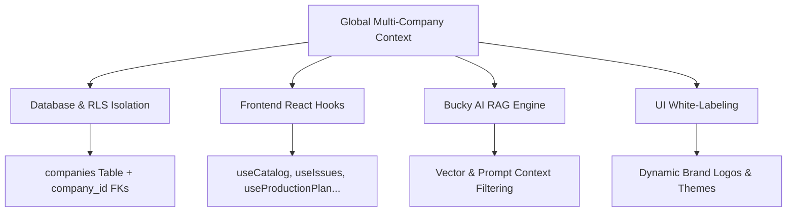

# Multi-Company AIGC Hub Architecture Plan & Developer Handover

> **Document Version**: 1.0.0  
> **Date**: July 24, 2026  
> **Author**: AI Pair Architecture Team  
> **Status**: Feasibility Approved / Placeholder Phase 1 Implemented  
> **Target Scope**: Multi-Tenant AIGC Production Infrastructure Migration  

---

## 1. Executive Summary & Context

During sprint planning, Lifewood leadership requested a strategic pivot: **transforming this AIGC Video Production Dashboard from a single-company tool (BuckedUp only) into a centralized, multi-tenant AIGC management platform** capable of serving multiple partnered brands (e.g., BuckedUp, Red Bull, Monster Energy, Celsius, NutraBio).

### Primary Directive for Current Phase
1. **Analyze & Scan Architecture**: Assess the technical feasibility, complexity, risks, and migration path for turning the system into a multi-company hub without performing full database refactoring yet.
2. **Implement UI Placeholder**: In `AppHeader.tsx`, convert the static brand title into an interactive company selection dropdown filter.
   * **Subtle Aesthetics**: Appears completely un-styled when unhovered (matching original flat text layout), revealing hover glassmorphism and a chevron trigger only on mouse hover/click.
   * **Role Restricted**: Accessible exclusively to `Super-Admin` and `Admin` accounts.
   * **Theme Aware**: Supports seamless rendering across both Dark obsidian and Light mode themes.

---

## 2. Technical Feasibility & Scan Findings

### **Overall Feasibility Verdict: 100% FEASIBLE**
The existing architecture (Next.js 16 + React 19 + Supabase PostgreSQL with RLS) provides a solid foundation. Transitioning from single-tenant to multi-tenant is an established SaaS pattern.

### **System Complexity Rating: 7 / 10 (Moderate to High)**
* **Estimated Effort**: 1.5 to 2 Sprints (~10–14 engineering days)
* **Primary Challenge**: Ensuring strict data isolation between competitor companies at the Database (RLS) and AI Assistant (Bucky) layers.

---

## 3. Impact Analysis by Architecture Layer



### Layer 1: Database & Security (Supabase PostgreSQL / RLS)
* **Current State**: `products`, `issues`, `production_plan`, `catalog_products`, `video_requests`, and `bucky_conversations` operate on flat tables with no tenant isolation.
* **Migration Requirements**:
  1. Create a `companies` table (`id`, `name`, `slug`, `logo_url`, `status`, `created_at`).
  2. Add `company_id uuid references companies(id)` to all core domain tables with default migrations (`DEFAULT 'buckedup-uuid'`).
  3. Update `profiles` table to track primary company affiliation and a `user_company_access` junction table for Lifewood admins managing multiple brands.
  4. Rewrite Supabase Row-Level Security (RLS) policies to enforce isolation at the database level:
     ```sql
     create policy "Tenant Product Isolation" on products for select
     using (company_id = auth.jwt() -> 'company_id' or get_my_role() = 'super-admin');
     ```

### Layer 2: Frontend Hooks & State Management (`/lib/`)
* **Current State**: Custom hooks (`useCatalog`, `useProductionPlan`, `useVideoRequests`, `useIssues`, `useTodayStats`, etc.) fetch global data.
* **Migration Requirements**:
  1. Wrap application with a `CompanyContext` (`activeCompany`, `setActiveCompany`, `availableCompanies`).
  2. Update all custom hooks to filter queries:
     ```ts
     // Example adaptation in custom hook
     const { data } = await supabase
       .from('products')
       .select('*')
       .eq('company_id', activeCompany.id);
     ```

### Layer 3: Bucky AI Assistant Engine (`/lib/bucky/`)
* **Current State**: Bucky AI builds RAG prompts from global product catalog statistics and issues.
* **Migration Requirements**:
  1. Inject `company_id` metadata into all vector embeddings and conversation contexts (`bucky_conversations`).
  2. Strictly scope system prompts so Bucky cannot leak competitor metrics across partner workspaces.

### Layer 4: UI & Branding System
* **Current State**: Static logo (`/buckedup-alt.svg`) and hardcoded header strings.
* **Completed (Phase 1)**: Integrated interactive company selection dropdown filter in `AppHeader.tsx` restricted to Super Admin / Admin roles.
* **Future Migration**: Bind dropdown selection to `CompanyContext` to dynamically swap active catalog, dashboards, and company logos.

---

## 4. Phase 1 Implementation Summary (`AppHeader.tsx`)

| Requirement | Implementation Detail | Status |
| :--- | :--- | :--- |
| **Dropdown Component** | Interactive popover with static company options (`BuckedUp`, `Red Bull`, `Monster Energy`, `Celsius`, `NutraBio`). | ✅ Completed |
| **Subtle Hover Effect** | Unhovered state looks like plain flat text; hover/open state reveals glassmorphism background (`rgba(255,255,255,0.08)`), rounded border (`6px`), and rotating `ChevronDown`. | ✅ Completed |
| **Role Restriction** | Scoped via `role === 'super-admin' || role === 'admin'`. Non-admins see the original static header view. | ✅ Completed |
| **Light & Dark Theme Styling** | Configured popover container and item text using theme CSS variables (`var(--panel-bg-opaque)`, `var(--ink)`, `var(--ink-soft)`, `var(--castleton)`). | ✅ Completed |

---

## 5. Risk Assessment & Mitigation Matrix

| Risk Event | Severity | Impact | Mitigation Strategy |
| :--- | :---: | :--- | :--- |
| **Data Leakage Between Competitors** | High | Critical legal risk if Brand A accesses Brand B's video pipeline | Enforce isolation via **Postgres RLS Policies**, not client-side JS filters alone. |
| **Legacy Data Corruption** | Medium | Risk of existing BuckedUp records becoming orphaned | Assign `DEFAULT 'buckedup-uuid'` during database migration. |
| **Query Performance Degradation** | Low | Slower dashboard queries as data scales across companies | Add composite indexes `(company_id, status)` and `(company_id, rank)`. |

---

## 6. Handover Checklist for Future Developers

- [ ] Execute Supabase SQL migration to create `companies` table and add `company_id` columns.
- [ ] Implement `CompanyContext` in `components/Dashboard.tsx` or app layout.
- [ ] Connect `AppHeader.tsx` dropdown `selectedCompany` state to global `CompanyContext`.
- [ ] Audit and update all ~15 custom hooks in `/lib/` to scope Supabase queries by `company_id`.
- [ ] Update Bucky AI context builders in `lib/bucky/` to filter vector queries by tenant.
- [ ] Verify RLS policies with test user accounts for each partner company.
