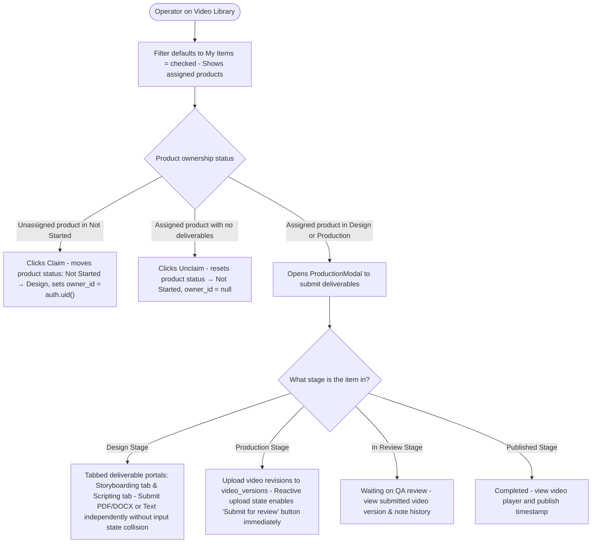
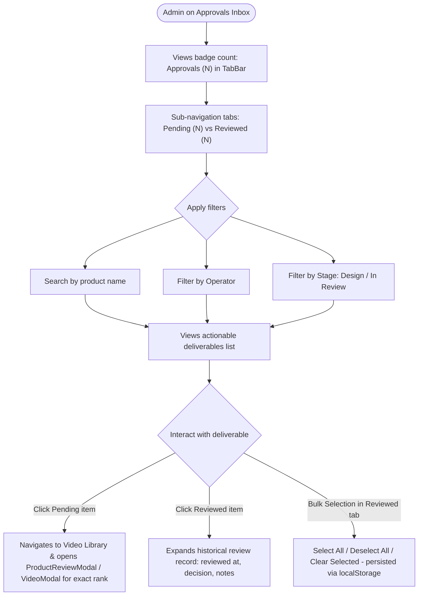
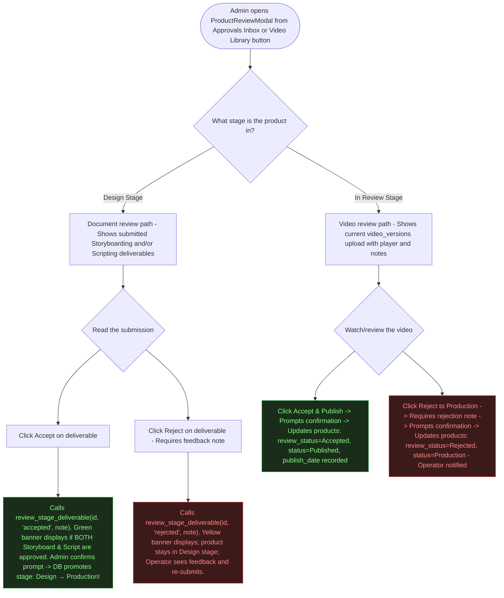
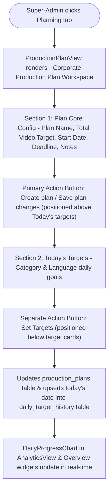
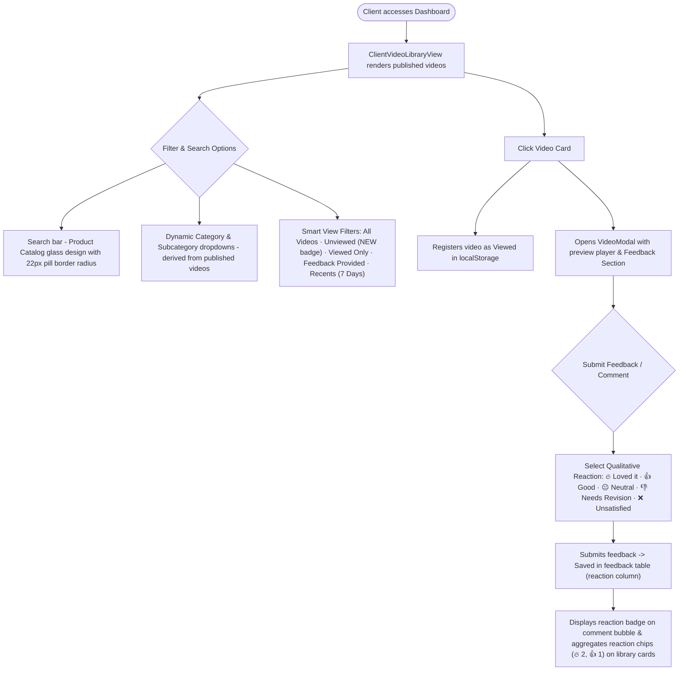

# BuckedUp Dashboard — Role-Based Workflow & Flowcharts

> **System**: BuckedUp AIGC Video Production Dashboard  
> **Roles**: Operator · Admin · Super-Admin  
> **Last Updated**: July 23, 2026

---

## System Overview

The dashboard is a **video production pipeline tracker** for BuckedUp's AIGC (AI-Generated Content) operation. It moves video requests through a **5-stage pipeline** (`Not Started` → `Design` → `Production` → `In Review` → `Published`), with pre-video document deliverables (`Storyboarding` and `Scripting`) tracked inside the `stage_deliverables` table during the `Design` stage, and video uploads tracked inside `video_versions` during the `Production` stage.

> [!IMPORTANT]
> **The database is the real security boundary** — not the UI. Every permission below is enforced by PostgreSQL Row-Level Security (RLS) policies and `enforce_product_update_permissions()` triggers in `schema.sql`. The UI hides controls a role cannot use, but the DB actually blocks unauthorized writes.
>
> **Strict QA Gate Stage Transitions**: Stage jumping is disabled across all roles (`canMoveStage={false}`). Admins and Super-Admins cannot manually force arbitrary stage moves in dropdowns or Kanban drag-and-drop. Products move stages **only** through the official QA approval process.

---

## Role Summary

| Role | Who | Core Purpose |
|------|-----|-------------|
| **Operator** | Production staff (videographers, editors, AI operators) | Execute work — claim/unclaim products, upload document/video deliverables per stage (`stage_deliverables` / `video_versions`), report issues, and submit for QA review |
| **Admin** | Lifewood leadership / production managers (formerly Lead) | Own the pipeline — create listings, prioritize (`High/Medium/Low`), review and advance stages via the **Approvals Inbox** (`ReviewsView`), conduct QA checks, and manage Operators |
| **Super-Admin** | Governance-only administrators (formerly Admin) | Manage user accounts (`profiles`), import corporate Excel production plans (`Planning`), view AI audit logs (`Bucky`), and enforce system security while sharing full operational QA/catalog parity with Admins |
| **Client** | BuckedUp stakeholders | View published videos, provide feedback via qualitative reactions, review completed work |

---

## Navigation by Role

| Tab | Operator | Admin | Super-Admin | Client |
|-----|----------|-------|-------------|--------|
| **Overview** | ✅ Read-only | ✅ Read-only | ✅ Read-only | ❌ Not visible |
| **Approvals (`reviews`)** | ❌ Not visible | ✅ Full review access (`ReviewsView` inbox) | ✅ Full review access | ❌ Not visible |
| **Catalog** | ✅ View only | ✅ Full manage (add/edit/delete catalog items, request videos) | ✅ Full manage | ❌ Not visible |
| **Video Library** | ✅ Submit deliverables for owned items | ✅ Full pipeline QA control | ✅ Full pipeline QA control | ✅ View published only |
| **Analytics** | ❌ Blocked (redirects to Overview) | ✅ View all charts (`DailyProgressChart`) | ✅ View all charts | ❌ Blocked |
| **Planning** | ❌ Not visible | ❌ Not visible | ✅ Super-Admin corporate target imports & plan config (`ProductionPlanView`) | ❌ Not visible |
| **Admin** | ❌ Not visible | ❌ Not visible | ✅ User governance (`ManageUsersView`) | ❌ Not visible |
| **Bucky** | ❌ Not visible | ❌ Not visible | ✅ AI audit log viewer (`BuckyConversationsView`) | ❌ Not visible |

---

## Pipeline Stages, Deliverables & Strict QA Gates

```
Not Started → Design → Production → In Review → Published
```

| Stage | Operator Action | Deliverable Type | Admin / Super-Admin Review Action & Gate Enforcement |
|-------|-----------------|------------------|----------------------------------------------------|
| **Not Started** | Claim product (`owner_id = auth.uid()`, moves to `Design`) | — | Admin assigns priority (`High/Medium/Low`) and owner. |
| **Design** | Submit Storyboard (`file`/`text`) and Script (`file`/`text`) via independent tabbed portals in `ProductionModal` | `stage_deliverables` rows | Admin/Super-Admin reviews in **Approvals Inbox** (`ReviewsView`) or `ProductReviewModal`. Calling `review_stage_deliverable(id, 'accepted', note)` evaluates both deliverables. When **BOTH Storyboard and Script are approved**, UI prompts confirmation and product **automatically promotes to `Production`**. |
| **Production** | Upload video revision (`video_versions`) with optional notes, then call `submit_video_for_review(product_id)`. Reactive UI enables review button instantly upon upload. | `video_versions` row + SQL RPC | Operator/Admin calls RPC; DB verifies ownership, verifies at least one video exists, and promotes product stage to `In Review`. |
| **In Review** | — (waiting on QA review) | — | Admin/Super-Admin reviews video in `ProductReviewModal`. Clicking **Accept & Publish** prompts confirmation and promotes to **`Published`** (`publish_date` recorded). Clicking **Reject to Production** prompts confirmation, sets rejection note, and returns stage to **`Production`**. |
| **Published** | — | — | Terminal completed state. Items with `deliveryType === "link"` enter directly as Published. |

> [!NOTE]
> **Stage Locking**: In `ProductFormModal`, the Stage field is disabled (`disabled={true}`) for all roles with the clear hint: *"Stage transitions are managed automatically via the QA Review process."* Drag-and-drop on `KanbanBoard` is set to `canMoveStage={false}` to prevent arbitrary stage skipping.

---

## 🟦 OPERATOR WORKFLOW

> **Operator = Production staff who execute the content work.**  
> They claim and are assigned products to work on, submit deliverables per stage, and flag issues. They never create catalog listings, never force arbitrary stage moves, and never review others' work.

### Access & Entry


---

### Overview Tab (Read-Only)


---

### Video Library Tab — Core Operator & Claim Flow



---

### Operator: What They CANNOT Do

```mermaid
flowchart LR
    subgraph BLOCKED_OP ["Actions Blocked for Operator - DB Enforced"]
        B1["Move product stage directly - DB trigger rejects status changes unless via submit_video_for_review RPC"]
        B2["Create new products or add product to pipeline"]
        B3["Edit catalog fields - name, category, owner, content angle"]
        B4["Delete products"]
        B5["Access Approvals tab - not rendered in TabBar for operator role"]
        B6["Access Analytics tab - route guard redirects to Overview"]
        B7["Submit deliverables for non-owned products - RLS blocks insert where owner_id does not match auth.uid"]
        B8["Change user roles"]
        B9["Create or edit production plan"]
        B10["Approve or reject deliverables - no Review buttons shown"]
        B11["Request videos from Catalog - Request from Catalog button hidden"]
    end
    style BLOCKED_OP fill:#3d1a1a,stroke:#dc3545
    style B1 fill:#3d1a1a,stroke:#dc3545,color:#ff8888
    style B2 fill:#3d1a1a,stroke:#dc3545,color:#ff8888
    style B3 fill:#3d1a1a,stroke:#dc3545,color:#ff8888
    style B4 fill:#3d1a1a,stroke:#dc3545,color:#ff8888
    style B5 fill:#3d1a1a,stroke:#dc3545,color:#ff8888
    style B6 fill:#3d1a1a,stroke:#dc3545,color:#ff8888
    style B7 fill:#3d1a1a,stroke:#dc3545,color:#ff8888
    style B8 fill:#3d1a1a,stroke:#dc3545,color:#ff8888
    style B9 fill:#3d1a1a,stroke:#dc3545,color:#ff8888
    style B10 fill:#3d1a1a,stroke:#dc3545,color:#ff8888
    style B11 fill:#3d1a1a,stroke:#dc3545,color:#ff8888
```



---

## 🟨 ADMIN WORKFLOW (formerly Lead)

> **Admin = The operational owner of the entire pipeline.**  
> Admins create video requests, assign priority (`High/Medium/Low`), configure targets, review all deliverables inside the **Approvals Inbox** (`ReviewsView`), and evaluate QA approvals to advance stages.

### Approvals Inbox Tab (`ReviewsView.tsx` — Core QA Center)



---

### Video Library — Admin: Reviewing Deliverables & Stage Progression (`ProductReviewModal`)



---

## 🟥 SUPER-ADMIN WORKFLOW (formerly Admin)

> **Super-Admin = Governance, Corporate Planning & Shared Operational Parity.**  
> Super-Admins share full operational parity with Admins across the day-to-day video production pipeline (`Video Library across all stages`, `Catalog management`, and `Approvals Inbox`). In addition, Super-Admins exclusively manage user accounts (`profiles`), import corporate Excel spreadsheets (`PlanningView`), and audit AI execution logs (`Bucky`).

### Planning Tab — Super-Admin Exclusive (`ProductionPlanView.tsx`)



---

## 🟩 CLIENT DASHBOARD WORKFLOW (`ClientVideoLibraryView.tsx`)

> **Client Dashboard = Dedicated Portal for Client Video Browsing, Download & Feedback.**  
> Clients view published marketing deliverables with dynamic filtering and a qualitative satisfaction reaction system.



---

## Role Permission Matrix (Complete Reference)

| Action | Operator | Admin | Super-Admin | Client | DB / UI Enforcement |
|--------|----------|-------|-------------|--------|---------------------|
| **Login / sign out** | ✅ | ✅ | ✅ | ✅ | Supabase Auth |
| **View Overview** | ✅ | ✅ | ✅ | ❌ | — |
| **View Approvals Inbox (`reviews`)** | ❌ | ✅ | ✅ | ❌ | TabBar role check (`role === 'admin' || role === 'super-admin'`) |
| **Browse Catalog** | ✅ | ✅ | ✅ | ❌ | — |
| **Add/edit/delete catalog items** | ❌ | ✅ | ✅ | ❌ | `catalog_products` RLS & UI check |
| **Request video from catalog** | ❌ | ✅ | ✅ | ❌ | `products` insert RLS |
| **Claim / Unclaim product** | ✅ | ✅ | ✅ | ❌ | `enforce_product_update_permissions` trigger |
| **View Library — all stages** | ✅ | ✅ | ✅ | ❌ (published only) | Same video library for all roles |
| **Board (Kanban) layout** | ✅ (view only) | ✅ (view only) | ✅ (view only) | ❌ | Stage moves locked (`canMoveStage={false}`) |
| **Submit document deliverables** | ✅ | ✅ | ✅ | ❌ | `stage_deliverables` RLS |
| **Upload video version (`video_versions`)** | ✅ (own items) | ✅ | ✅ | ❌ | `video_versions` RLS |
| **Submit for review (`RPC`)** | ✅ (own items) | ✅ | ✅ | ❌ | `submit_video_for_review()` SQL validation |
| **Review stage deliverables (`RPC`)** | ❌ | ✅ | ✅ | ❌ | `review_stage_deliverable()` SQL check |
| **Accept both docs → auto-advance to Production** | ❌ | ✅ | ✅ | ❌ | Automated SQL trigger / function + confirmation prompt |
| **Accept video → publish** | ❌ | ✅ | ✅ | ❌ | `products` update RLS + confirmation prompt |
| **Reject video → back to Production** | ❌ | ✅ | ✅ | ❌ | `products` update RLS (`rejection_reason`) + confirmation prompt |
| **Arbitrary Stage Jump Dropdown / Override** | ❌ | ❌ | ❌ | ❌ | Stage field disabled (`disabled={true}`) for all roles |
| **Add / edit / delete product** | ❌ | ✅ | ✅ | ❌ | `enforce_product_update_permissions` trigger |
| **Set priority (`High/Medium/Low`)** | ❌ | ✅ | ✅ | ❌ | `products` update RLS |
| **Report / resolve issues** | ✅ | ✅ | ✅ | ❌ | `issues` RLS |
| **View Analytics charts** | ❌ (redirects) | ✅ | ✅ | ❌ | Route guard + UI check |
| **View Planning tab (Excel imports & targets)** | ❌ | ❌ | ✅ | ❌ | TabBar role check (`role === 'super-admin'`) & DB RLS |
| **Set daily category/language targets** | ❌ | ❌ | ✅ | ❌ | Writes to `production_plans` & `daily_target_history` |
| **View Admin tab (User governance)** | ❌ | ❌ | ✅ | ❌ | TabBar role check (`role === 'super-admin'`) |
| **View Bucky AI Audit Logs tab** | ❌ | ❌ | ✅ | ❌ | TabBar role check (`role === 'super-admin'`) |
| **Bucky AI Assistant (`BuckyWidget`)** | ✅ | ✅ | ✅ | ✅ | Contextual streaming chat (`move_product_stage` disabled) |
