# BuckedUp Dashboard — Role-Based Workflow & Flowcharts

> **System**: BuckedUp AIGC Video Production Dashboard  
> **Roles**: Operator · Lead · Admin  
> **Last Analyzed**: July 17, 2026

---

## System Overview

The dashboard is a **video production pipeline tracker** for BuckedUp's AIGC (AI-Generated Content) operation. It moves video requests through a **6-stage pipeline** (Not Started → Storyboarding → Scripting → Prompting → Editing → In Review → Published), with each stage requiring a submitted deliverable that a Lead must approve before the item advances.

> [!IMPORTANT]
> **The database is the real security boundary** — not the UI. Every permission below is enforced by PostgreSQL RLS policies and `enforce_product_update_permissions()` triggers in `schema.sql`. The UI hides controls a role cannot use, but the DB actually blocks unauthorized writes.

---

## Role Summary

| Role | Who | Core Purpose |
|------|-----|-------------|
| **Operator** | Production staff (videographers, editors, AI operators) | Execute work — upload deliverables per stage, manage their assigned queue, report issues |
| **Lead** | Lifewood leadership / production managers | Own the pipeline — create listings, configure plans, review and advance every stage, manage Operators |
| **Admin** | Governance-only administrators | Manage user accounts (create/promote/demote/delete users) — no product write access at all |

---

## Navigation by Role

| Tab | Operator | Lead | Admin |
|-----|----------|------|-------|
| **Overview** | ✅ Read-only | ✅ Read-only | ✅ Read-only |
| **Catalog** | ✅ View only | ✅ Full manage (add/edit/delete catalog items, request videos) | ✅ View only |
| **Video Library** | ✅ Submit deliverables for own items | ✅ Full pipeline control | ✅ Published items only (read) |
| **Analytics** | ✅ View all charts | ✅ View all charts | ✅ View all charts |
| **Planning** | ❌ Not visible | ✅ Configure production plan | ❌ Not visible |
| **Admin** | ❌ Not visible | ❌ Not visible | ✅ User governance |

---

## Pipeline Stages & Deliverables

```
Not Started → Storyboarding → Scripting → Prompting → Editing → In Review → Published
```

| Stage | Operator Action | Deliverable Type | Lead Review Action |
|-------|-----------------|------------------|-------------------|
| Not Started | — | — | Lead kicks off, sets to Storyboarding |
| Storyboarding | Submit file (PDF/DOCX) or text | `stage_deliverables` row | Accept advances to Scripting / Reject stays, note given |
| Scripting | Submit file (PDF/DOCX) or text | `stage_deliverables` row | Accept advances to Prompting / Reject stays, note given |
| Prompting | Submit text (text-only, no file) | `stage_deliverables` row | Accept advances to Editing / Reject stays, note given |
| Editing | Upload video version to Supabase Storage, then "Submit for review" | `video_versions` + RPC | Accept Published / Reject back to Editing |
| In Review | — (waiting) | — | Accept Published / Reject back to Editing |
| Published | — | — | — |

---

## 🟦 OPERATOR WORKFLOW

> **Operator = Production staff who execute the content work.**
> They are assigned products to work on, submit deliverables per stage, and flag issues. They never create listings, never move stages themselves, and never review others' work.

### Access & Entry

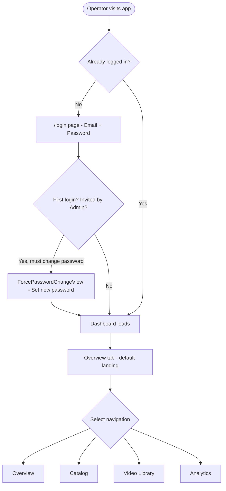
```mermaid
flowchart TD
    A([Operator visits app]) --> B{Already logged in?}
    B -- No --> C["/login page - Email + Password"]
    C --> D{"First login? Invited by Admin?"}
    D -- "Yes, must change password" --> E["ForcePasswordChangeView - Set new password"]
    E --> F[Dashboard loads]
    D -- No --> F
    B -- Yes --> F
    F --> G["Overview tab - default landing"]
    G --> H{Select navigation}
    H --> TAB1[Overview]
    H --> TAB2[Catalog]
    H --> TAB3[Video Library]
    H --> TAB4[Analytics]
```

---

### Overview Tab (Read-Only)

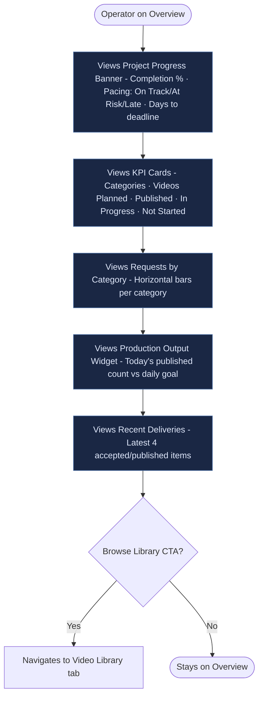
```mermaid
flowchart TD
    A([Operator on Overview]) --> B["Views Project Progress Banner - Completion % · Pacing: On Track/At Risk/Late · Days to deadline"]
    B --> C["Views KPI Cards - Categories · Videos Planned · Published · In Progress · Not Started"]
    C --> D[Views Requests by Category - Horizontal bars per category]
    D --> E["Views Production Output Widget - Today's published count vs daily goal"]
    E --> F["Views Recent Deliveries - Latest 4 accepted/published items"]
    F --> G{Browse Library CTA?}
    G -- Yes --> H[Navigates to Video Library tab]
    G -- No --> I([Stays on Overview])

    style B fill:#1a2744,stroke:#4a6fa5,color:#e0e8ff
    style C fill:#1a2744,stroke:#4a6fa5,color:#e0e8ff
    style D fill:#1a2744,stroke:#4a6fa5,color:#e0e8ff
    style E fill:#1a2744,stroke:#4a6fa5,color:#e0e8ff
    style F fill:#1a2744,stroke:#4a6fa5,color:#e0e8ff
```

> [!NOTE]
> Operator sees the same Overview as Lead and Admin — it's entirely read-only. The inline deadline edit on the Production Output Widget is **Lead-only** (hidden from Operators).

---

### Catalog Tab (View Only)


```mermaid
flowchart TD
    A([Operator on Catalog]) --> B["Browses BuckedUp product catalog - All supplements, drinks, apparel and gear"]
    B --> C{Apply filters}
    C --> D[Search by name / variant]
    C --> E[Filter by Category / Subcategory]
    C --> F["Filter by AIGC Status - none / in-progress / published"]
    C --> G["Filter by Flag - Bestseller / New / Clearance"]
    C --> H["Filter by Availability - active / inactive / all"]
    D & E & F & G & H --> I[Views filtered product grid or list]
    I --> J{Open product detail?}
    J -- Yes --> K["Detail panel: name, category, variants, price, AIGC badge"]
    K --> L{Linked video production item?}
    L -- Yes --> M[Sees link to Video Library item]
    L -- No --> N["Sees 'No Video' badge"]
    J -- No --> O([Continue browsing])

    style B fill:#1a2744,stroke:#4a6fa5,color:#e0e8ff

    subgraph BLOCKED_OP_CAT ["Actions blocked for Operator in Catalog"]
        BL1["Cannot: Add catalog item"]
        BL2["Cannot: Edit catalog item"]
        BL3["Cannot: Delete catalog item"]
        BL4["Cannot: Request video from catalog"]
    end

    style BLOCKED_OP_CAT fill:#3d1a1a,stroke:#dc3545
    style BL1 fill:#3d1a1a,stroke:#dc3545,color:#ff8888
    style BL2 fill:#3d1a1a,stroke:#dc3545,color:#ff8888
    style BL3 fill:#3d1a1a,stroke:#dc3545,color:#ff8888
    style BL4 fill:#3d1a1a,stroke:#dc3545,color:#ff8888
```

---

### Video Library Tab — Core Operator Flow

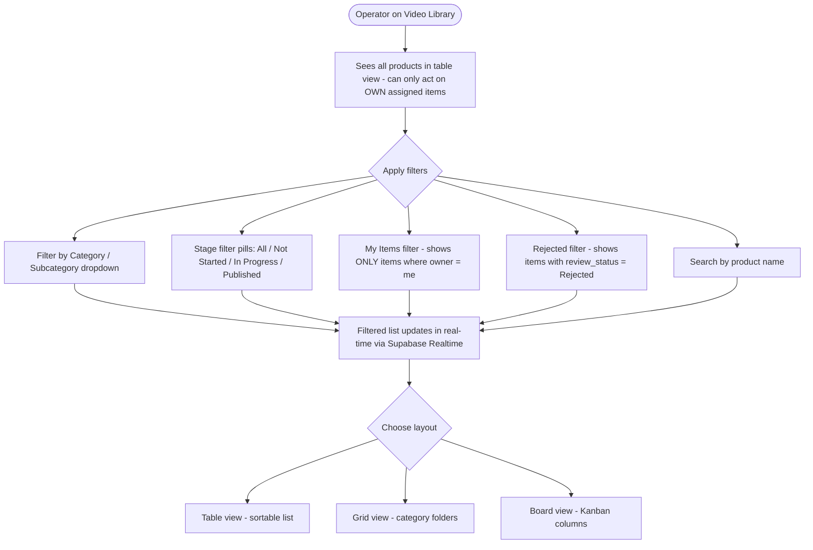
```mermaid
flowchart TD
    A([Operator on Video Library]) --> B["Sees all products in table view - can only act on OWN assigned items"]
    B --> C{Apply filters}
    C --> D[Filter by Category / Subcategory dropdown]
    C --> E["Stage filter pills: All / Not Started / In Progress / Published"]
    C --> F["My Items filter - shows ONLY items where owner = me"]
    C --> G["Rejected filter - shows items with review_status = Rejected"]
    C --> H[Search by product name]
    D & E & F & G & H --> I[Filtered list updates in real-time via Supabase Realtime]
    I --> J{Choose layout}
    J --> K["Table view - sortable list"]
    J --> L["Grid view - category folders"]
    J --> M["Board view - Kanban columns"]
```

---

### Video Library — Operator: Submit Deliverable (Main Workflow)

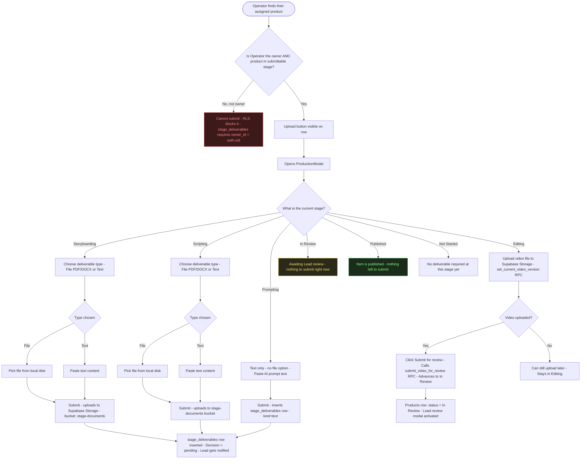
```mermaid
flowchart TD
    A([Operator finds their assigned product]) --> B{"Is Operator the owner AND product in submittable stage?"}
    B -- "No, not owner" --> BLK1["Cannot submit - RLS blocks it - stage_deliverables requires owner_id = auth.uid"]
    B -- Yes --> C[Upload button visible on row]
    C --> D[Opens ProductionModal]
    D --> E{What is the current stage?}

    E -- Storyboarding --> F1["Choose deliverable type - File PDF/DOCX or Text"]
    F1 --> G1{Type chosen}
    G1 -- File --> H1[Pick file from local disk]
    H1 --> I1["Submit - uploads to Supabase Storage - bucket: stage-documents"]
    G1 -- Text --> J1[Paste text content]
    J1 --> I1

    E -- Scripting --> F2["Choose deliverable type - File PDF/DOCX or Text"]
    F2 --> G2{Type chosen}
    G2 -- File --> H2[Pick file from local disk]
    H2 --> I2["Submit - uploads to stage-documents bucket"]
    G2 -- Text --> J2[Paste text content]
    J2 --> I2

    E -- Prompting --> F3["Text only - no file option - Paste AI prompt text"]
    F3 --> I3["Submit - inserts stage_deliverables row - kind=text"]

    E -- Editing --> F4["Upload video file to Supabase Storage - set_current_video_version RPC"]
    F4 --> G4{Video uploaded?}
    G4 -- Yes --> H4["Click Submit for review - Calls submit_video_for_review RPC - Advances to In Review"]
    G4 -- No --> I4["Can still upload later - Stays in Editing"]

    E -- "In Review" --> WAIT["Awaiting Lead review - nothing to submit right now"]
    E -- Published --> DONE["Item is published - nothing left to submit"]
    E -- "Not Started" --> NS["No deliverable required at this stage yet"]

    I1 & I2 & I3 --> RESULT1["stage_deliverables row inserted - Decision = pending - Lead gets notified"]
    H4 --> RESULT2["Products row: status = In Review - Lead review modal activated"]

    style BLK1 fill:#3d1a1a,stroke:#dc3545,color:#ff8888
    style WAIT fill:#2a2a1a,stroke:#ffc107,color:#ffe066
    style DONE fill:#1a2d1a,stroke:#28a745,color:#88ff88
```

---

### Video Library — Operator: Viewing Deliverable Feedback

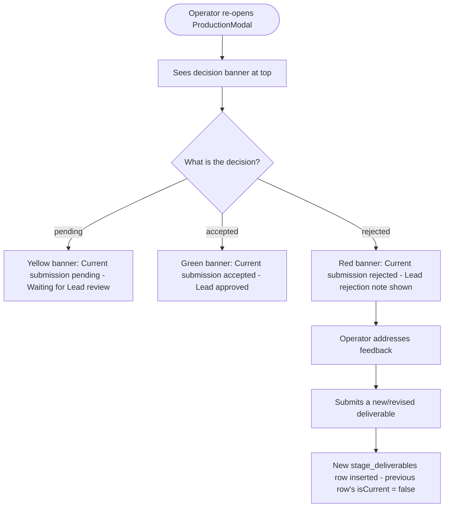
```mermaid
flowchart TD
    A([Operator re-opens ProductionModal]) --> B[Sees decision banner at top]
    B --> C{What is the decision?}
    C -- pending --> D["Yellow banner: Current submission pending - Waiting for Lead review"]
    C -- accepted --> E["Green banner: Current submission accepted - Lead approved"]
    C -- rejected --> F["Red banner: Current submission rejected - Lead rejection note shown"]
    F --> G[Operator addresses feedback]
    G --> H[Submits a new/revised deliverable]
    H --> I["New stage_deliverables row inserted - previous row's isCurrent = false"]
```

---

### Video Library — Operator: Issue Tracking

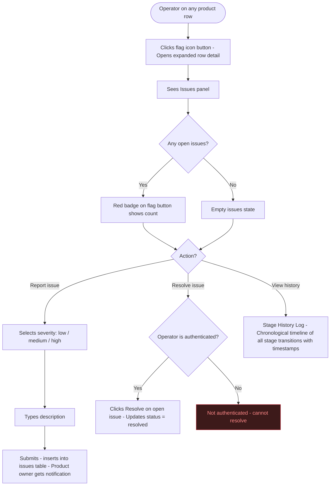
```mermaid
flowchart TD
    A([Operator on any product row]) --> B["Clicks flag icon button - Opens expanded row detail"]
    B --> C[Sees Issues panel]
    C --> D{Any open issues?}
    D -- Yes --> E[Red badge on flag button shows count]
    D -- No --> F[Empty issues state]
    E & F --> G{Action?}
    G -- "Report issue" --> H["Selects severity: low / medium / high"]
    H --> I[Types description]
    I --> J["Submits - inserts into issues table - Product owner gets notification"]
    G -- "Resolve issue" --> K{Operator is authenticated?}
    K -- Yes --> L["Clicks Resolve on open issue - Updates status = resolved"]
    K -- No --> BLK2["Not authenticated - cannot resolve"]
    G -- "View history" --> M["Stage History Log - Chronological timeline of all stage transitions with timestamps"]

    style BLK2 fill:#3d1a1a,stroke:#dc3545,color:#ff8888
```

---

### Operator: What They CANNOT Do


```mermaid
flowchart LR
    subgraph BLOCKED_OP ["Actions Blocked for Operator - DB Enforced"]
        B1["Move product stage - DB trigger rejects status changes from operator unless via submit_video_for_review RPC"]
        B2["Create new products or add product to pipeline"]
        B3["Edit catalog fields - name, category, owner, content angle"]
        B4["Delete products"]
        B5["Access Planning tab - not rendered in TabBar for operator role"]
        B6["Access Admin tab - not rendered in TabBar for operator role"]
        B7["Submit deliverables for non-owned products - RLS blocks insert where owner_id does not match auth.uid"]
        B8["Change user roles"]
        B9["Create or edit production plan"]
        B10["Approve or reject deliverables - no Review button shown"]
        B11["Request videos from Catalog - Request from Catalog button hidden"]
    end
    style BLOCKED_OP fill:#3d1a1a,stroke:#dc3545
    style B1 fill:#3d1a1a,stroke:#dc3545,color:#ff8888
    style B2 fill:#3d1a1a,stroke:#dc3545,color:#ff8888
    style B3 fill:#3d1a1a,stroke:#dc3545,color:#ff8888
    style B4 fill:#3d1a1a,stroke:#dc3545,color:#ff8888
    style B5 fill:#3d1a1a,stroke:#dc3545,color:#ff8888
    style B6 fill:#3d1a1a,stroke:#dc3545,color:#ff8888
    style B7 fill:#3d1a1a,stroke:#dc3545,color:#ff8888
    style B8 fill:#3d1a1a,stroke:#dc3545,color:#ff8888
    style B9 fill:#3d1a1a,stroke:#dc3545,color:#ff8888
    style B10 fill:#3d1a1a,stroke:#dc3545,color:#ff8888
    style B11 fill:#3d1a1a,stroke:#dc3545,color:#ff8888
```

---

### Notifications — Operator

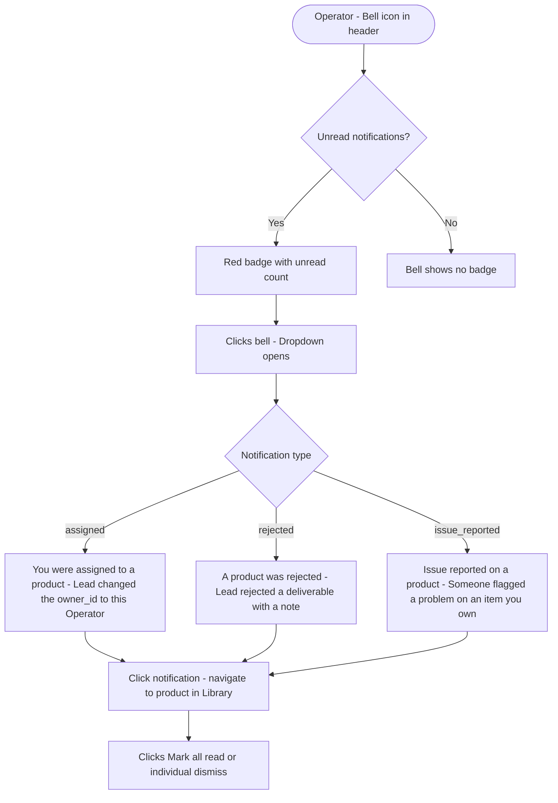
```mermaid
flowchart TD
    A(["Operator - Bell icon in header"]) --> B{Unread notifications?}
    B -- Yes --> C[Red badge with unread count]
    C --> D["Clicks bell - Dropdown opens"]
    D --> E{Notification type}
    E -- assigned --> F["You were assigned to a product - Lead changed the owner_id to this Operator"]
    E -- rejected --> G["A product was rejected - Lead rejected a deliverable with a note"]
    E -- issue_reported --> H["Issue reported on a product - Someone flagged a problem on an item you own"]
    F & G & H --> I["Click notification - navigate to product in Library"]
    I --> J["Clicks Mark all read or individual dismiss"]
    B -- No --> K[Bell shows no badge]
```

---

## 🟨 LEAD WORKFLOW

> **Lead = The operational owner of the entire pipeline.**  
> Leads are the fusion of the old "Approver" + catalog management "Admin". They create video requests, configure production targets, move products through every stage, review all deliverables, and are the only ones who can advance a product past any gate.

### Access & Entry

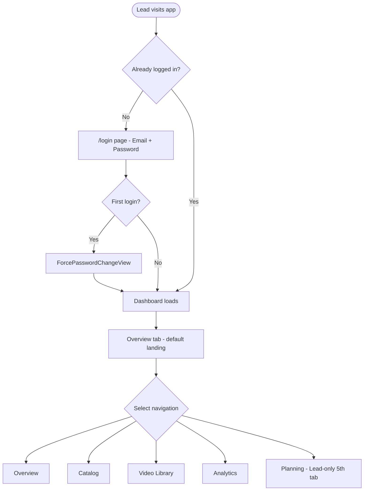
```mermaid
flowchart TD
    A([Lead visits app]) --> B{Already logged in?}
    B -- No --> C["/login page - Email + Password"]
    C --> D{First login?}
    D -- Yes --> E[ForcePasswordChangeView]
    E --> F[Dashboard loads]
    D -- No --> F
    B -- Yes --> F
    F --> G["Overview tab - default landing"]
    G --> H{Select navigation}
    H --> TAB1[Overview]
    H --> TAB2[Catalog]
    H --> TAB3[Video Library]
    H --> TAB4[Analytics]
    H --> TAB5["Planning - Lead-only 5th tab"]
```

---

### Overview Tab — Lead

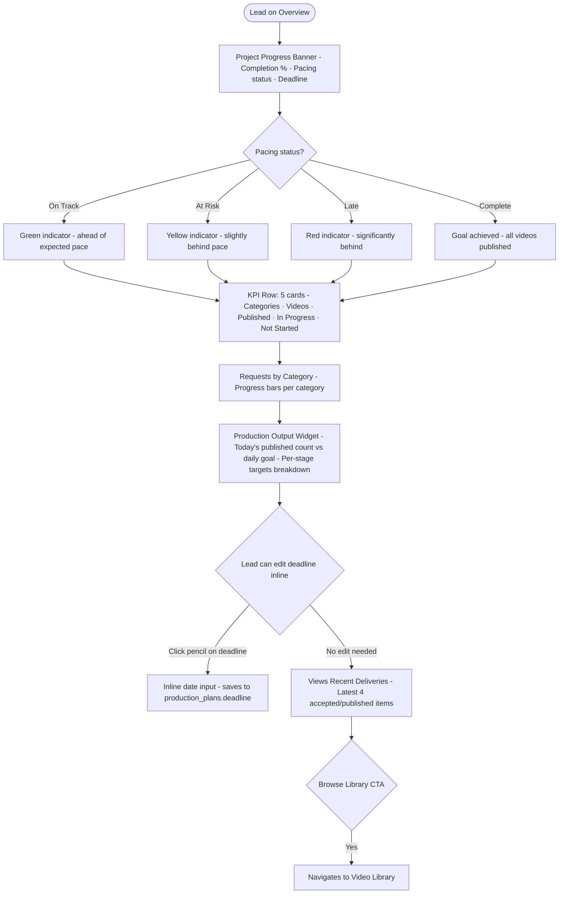
```mermaid
flowchart TD
    A([Lead on Overview]) --> B["Project Progress Banner - Completion % · Pacing status · Deadline"]
    B --> C{Pacing status?}
    C -- "On Track" --> D1["Green indicator - ahead of expected pace"]
    C -- "At Risk" --> D2["Yellow indicator - slightly behind pace"]
    C -- Late --> D3["Red indicator - significantly behind"]
    C -- Complete --> D4["Goal achieved - all videos published"]
    D1 & D2 & D3 & D4 --> E["KPI Row: 5 cards - Categories · Videos · Published · In Progress · Not Started"]
    E --> F["Requests by Category - Progress bars per category"]
    F --> G["Production Output Widget - Today's published count vs daily goal - Per-stage targets breakdown"]
    G --> H{Lead can edit deadline inline}
    H -- "Click pencil on deadline" --> I["Inline date input - saves to production_plans.deadline"]
    H -- "No edit needed" --> J["Views Recent Deliveries - Latest 4 accepted/published items"]
    J --> K{Browse Library CTA}
    K -- Yes --> L[Navigates to Video Library]
```

---

### Catalog Tab — Lead (Full Management)

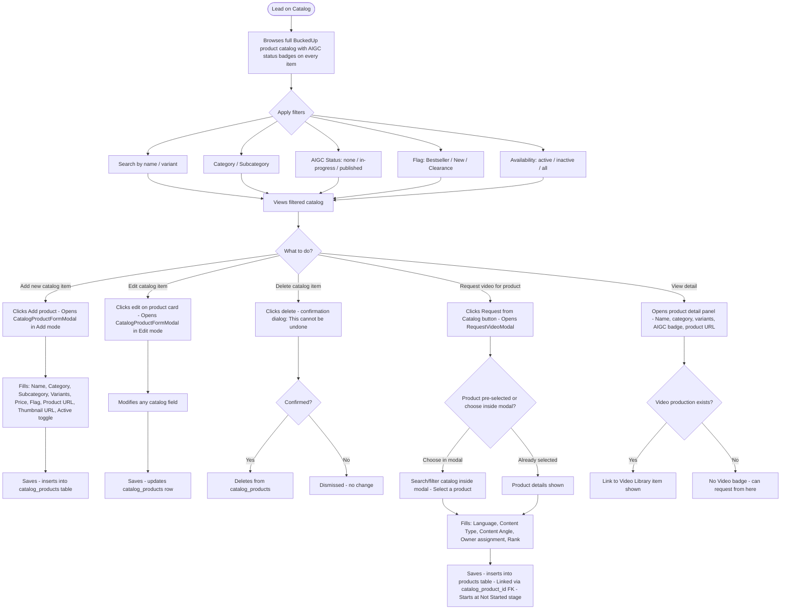
```mermaid
flowchart TD
    A([Lead on Catalog]) --> B["Browses full BuckedUp product catalog with AIGC status badges on every item"]
    B --> C{Apply filters}
    C --> D[Search by name / variant]
    C --> E[Category / Subcategory]
    C --> F["AIGC Status: none / in-progress / published"]
    C --> G["Flag: Bestseller / New / Clearance"]
    C --> H["Availability: active / inactive / all"]
    D & E & F & G & H --> I[Views filtered catalog]

    I --> J{What to do?}

    J -- "Add new catalog item" --> K["Clicks Add product - Opens CatalogProductFormModal in Add mode"]
    K --> K1["Fills: Name, Category, Subcategory, Variants, Price, Flag, Product URL, Thumbnail URL, Active toggle"]
    K1 --> K2["Saves - inserts into catalog_products table"]

    J -- "Edit catalog item" --> L["Clicks edit on product card - Opens CatalogProductFormModal in Edit mode"]
    L --> L1[Modifies any catalog field]
    L1 --> L2["Saves - updates catalog_products row"]

    J -- "Delete catalog item" --> M["Clicks delete - confirmation dialog: This cannot be undone"]
    M --> M1{Confirmed?}
    M1 -- Yes --> M2[Deletes from catalog_products]
    M1 -- No --> M3["Dismissed - no change"]

    J -- "Request video for product" --> N["Clicks Request from Catalog button - Opens RequestVideoModal"]
    N --> N1{"Product pre-selected or choose inside modal?"}
    N1 -- "Choose in modal" --> N2["Search/filter catalog inside modal - Select a product"]
    N1 -- "Already selected" --> N3[Product details shown]
    N2 & N3 --> N4["Fills: Language, Content Type, Content Angle, Owner assignment, Rank"]
    N4 --> N5["Saves - inserts into products table - Linked via catalog_product_id FK - Starts at Not Started stage"]

    J -- "View detail" --> O["Opens product detail panel - Name, category, variants, AIGC badge, product URL"]
    O --> P{Video production exists?}
    P -- Yes --> Q[Link to Video Library item shown]
    P -- No --> R["No Video badge - can request from here"]
```

---

### Video Library Tab — Lead: Full Pipeline Control

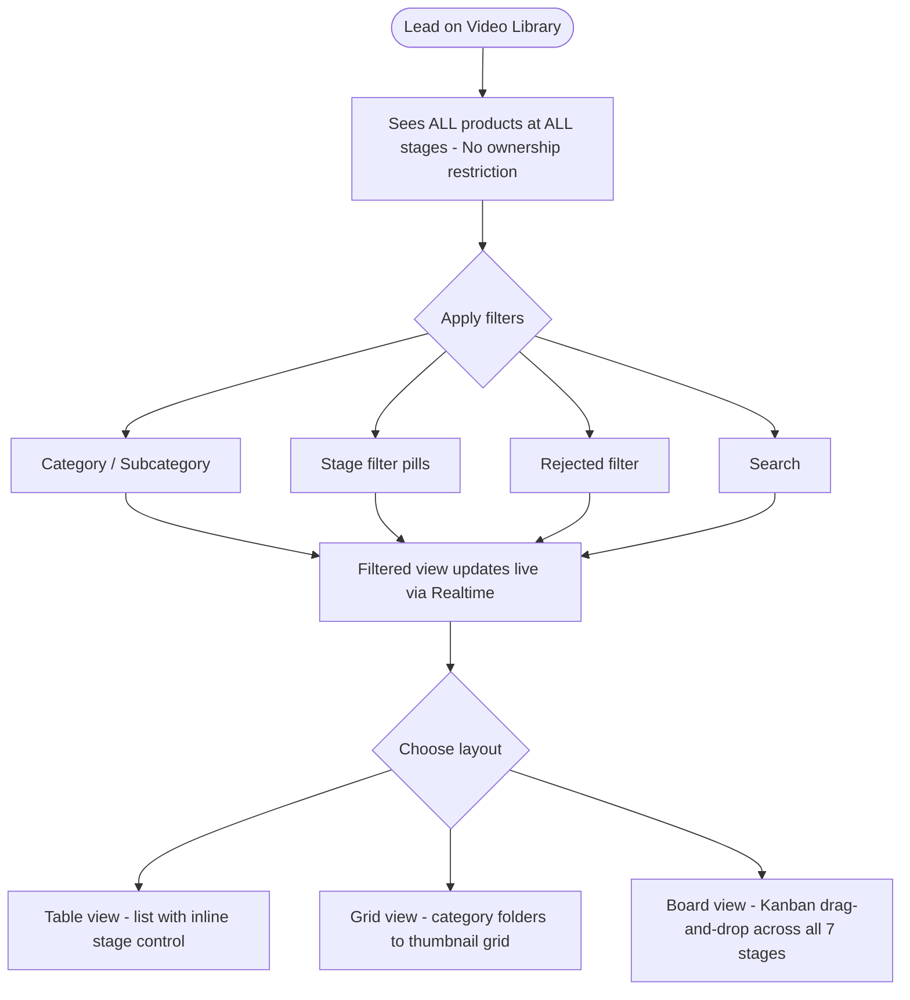
```mermaid
flowchart TD
    A([Lead on Video Library]) --> B["Sees ALL products at ALL stages - No ownership restriction"]
    B --> C{Apply filters}
    C --> D[Category / Subcategory]
    C --> E[Stage filter pills]
    C --> F[Rejected filter]
    C --> G[Search]
    D & E & F & G --> H[Filtered view updates live via Realtime]

    H --> I{Choose layout}
    I --> I1["Table view - list with inline stage control"]
    I --> I2["Grid view - category folders to thumbnail grid"]
    I --> I3["Board view - Kanban drag-and-drop across all 7 stages"]
```

---

### Video Library — Lead: Inline Stage Management

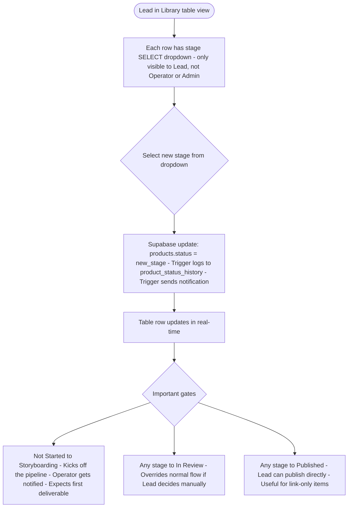
```mermaid
flowchart TD
    A([Lead in Library table view]) --> B["Each row has stage SELECT dropdown - only visible to Lead, not Operator or Admin"]
    B --> C{Select new stage from dropdown}
    C --> D["Supabase update: products.status = new_stage - Trigger logs to product_status_history - Trigger sends notification"]
    D --> E[Table row updates in real-time]
    E --> F{Important gates}
    F --> G["Not Started to Storyboarding - Kicks off the pipeline - Operator gets notified - Expects first deliverable"]
    F --> H["Any stage to In Review - Overrides normal flow if Lead decides manually"]
    F --> I["Any stage to Published - Lead can publish directly - Useful for link-only items"]
```

---

### Video Library — Lead: Reviewing Deliverables (Core Review Flow)

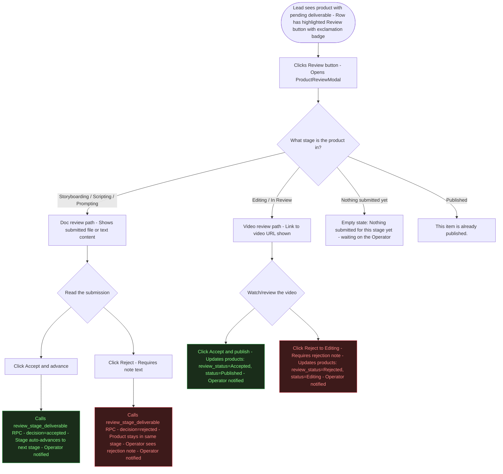
```mermaid
flowchart TD
    A(["Lead sees product with pending deliverable - Row has highlighted Review button with exclamation badge"]) --> B["Clicks Review button - Opens ProductReviewModal"]
    B --> C{What stage is the product in?}

    C -- "Storyboarding / Scripting / Prompting" --> D["Doc review path - Shows submitted file or text content"]
    D --> D1{Read the submission}
    D1 --> E1["Click Accept and advance"]
    D1 --> E2["Click Reject - Requires note text"]
    E1 --> F1["Calls review_stage_deliverable RPC - decision=accepted - Stage auto-advances to next stage - Operator notified"]
    E2 --> F2["Calls review_stage_deliverable RPC - decision=rejected - Product stays in same stage - Operator sees rejection note - Operator notified"]

    C -- "Editing / In Review" --> G["Video review path - Link to video URL shown"]
    G --> G1{Watch/review the video}
    G1 --> H1["Click Accept and publish - Updates products: review_status=Accepted, status=Published - Operator notified"]
    G1 --> H2["Click Reject to Editing - Requires rejection note - Updates products: review_status=Rejected, status=Editing - Operator notified"]

    C -- "Nothing submitted yet" --> EMPTY["Empty state: Nothing submitted for this stage yet - waiting on the Operator"]
    C -- Published --> PUB["This item is already published."]

    style F1 fill:#1a2d1a,stroke:#28a745,color:#88ff88
    style H1 fill:#1a2d1a,stroke:#28a745,color:#88ff88
    style F2 fill:#3d1a1a,stroke:#dc3545,color:#ff8888
    style H2 fill:#3d1a1a,stroke:#dc3545,color:#ff8888
```

---

### Video Library — Lead: Product Form (Add / Edit)

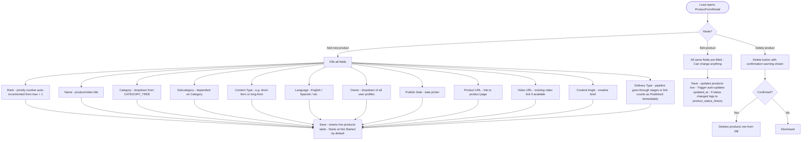
```mermaid
flowchart TD
    A([Lead opens ProductFormModal]) --> B{Mode?}

    B -- "Add new product" --> C[Fills all fields]
    C --> C1["Rank - priority number auto-incremented from max + 1"]
    C --> C2["Name - product/video title"]
    C --> C3["Category - dropdown from CATEGORY_TREE"]
    C --> C4["Subcategory - dependent on Category"]
    C --> C5["Content Type - e.g. short-form or long-form"]
    C --> C6["Language - English / Spanish / etc."]
    C --> C7["Owner - dropdown of all user profiles"]
    C --> C8["Publish Date - date picker"]
    C --> C9["Product URL - link to product page"]
    C --> C10["Video URL - existing video link if available"]
    C --> C11["Content Angle - creative brief"]
    C --> C12["Delivery Type - pipeline goes through stages or link counts as Published immediately"]
    C1 & C2 & C3 & C4 & C5 & C6 & C7 & C8 & C9 & C10 & C11 & C12 --> D["Save - inserts into products table - Starts at Not Started by default"]

    B -- "Edit product" --> E["All same fields pre-filled - Can change anything"]
    E --> F["Save - updates products row - Trigger auto-updates updated_at - If status changed logs to product_status_history"]

    B -- "Delete product" --> G["Delete button with confirmation warning shown"]
    G --> H{Confirmed?}
    H -- Yes --> I[Deletes products row from DB]
    H -- No --> J[Dismissed]
```

---

### Video Library — Lead: Kanban Board View

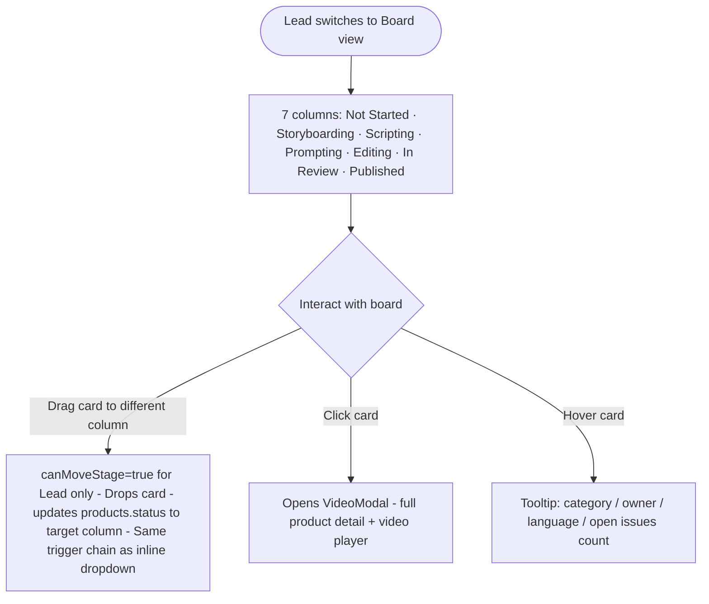
```mermaid
flowchart TD
    A([Lead switches to Board view]) --> B["7 columns: Not Started · Storyboarding · Scripting · Prompting · Editing · In Review · Published"]
    B --> C{Interact with board}
    C -- "Drag card to different column" --> D["canMoveStage=true for Lead only - Drops card - updates products.status to target column - Same trigger chain as inline dropdown"]
    C -- "Click card" --> E["Opens VideoModal - full product detail + video player"]
    C -- "Hover card" --> F["Tooltip: category / owner / language / open issues count"]
```

---

### Planning Tab — Lead Exclusive

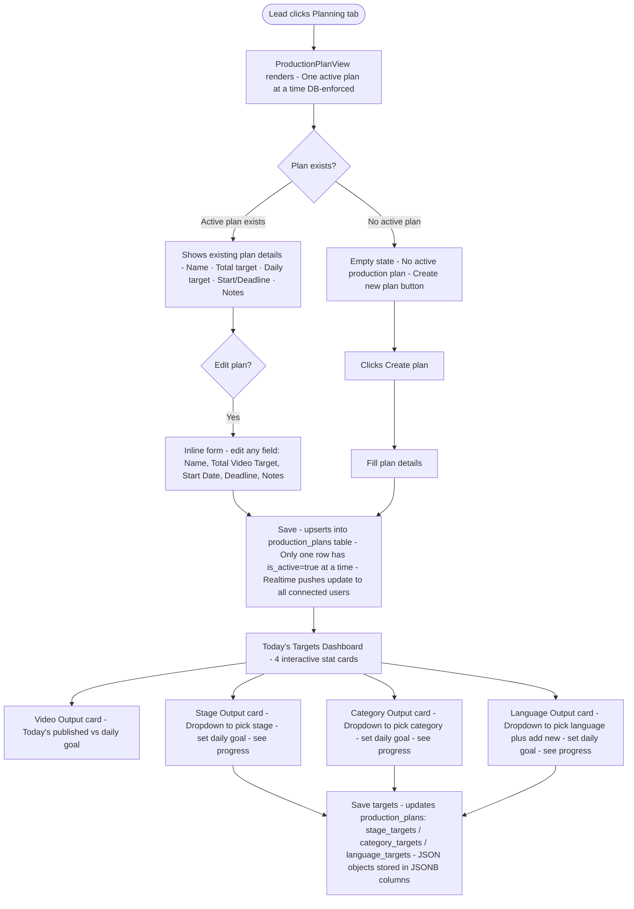
```mermaid
flowchart TD
    A([Lead clicks Planning tab]) --> B["ProductionPlanView renders - One active plan at a time DB-enforced"]
    B --> C{Plan exists?}

    C -- "No active plan" --> D["Empty state - No active production plan - Create new plan button"]
    D --> E["Clicks Create plan"]

    C -- "Active plan exists" --> F["Shows existing plan details - Name · Total target · Daily target · Start/Deadline · Notes"]
    F --> G{Edit plan?}
    G -- Yes --> H["Inline form - edit any field: Name, Total Video Target, Start Date, Deadline, Notes"]

    E --> I[Fill plan details]
    H & I --> J["Save - upserts into production_plans table - Only one row has is_active=true at a time - Realtime pushes update to all connected users"]

    J --> K["Today's Targets Dashboard - 4 interactive stat cards"]
    K --> K1["Video Output card - Today's published vs daily goal"]
    K --> K2["Stage Output card - Dropdown to pick stage - set daily goal - see progress"]
    K --> K3["Category Output card - Dropdown to pick category - set daily goal - see progress"]
    K --> K4["Language Output card - Dropdown to pick language plus add new - set daily goal - see progress"]

    K2 & K3 & K4 --> L["Save targets - updates production_plans: stage_targets / category_targets / language_targets - JSON objects stored in JSONB columns"]
```

---

### Lead: Issue Tracking

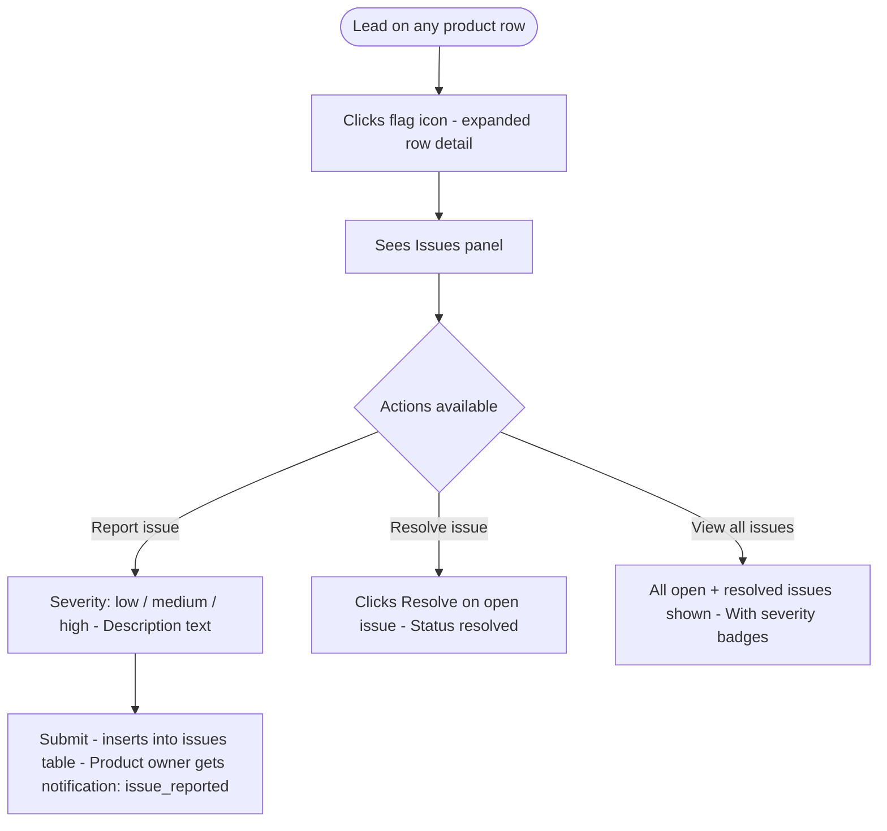
```mermaid
flowchart TD
    A([Lead on any product row]) --> B["Clicks flag icon - expanded row detail"]
    B --> C[Sees Issues panel]
    C --> D{Actions available}
    D -- "Report issue" --> E["Severity: low / medium / high - Description text"]
    E --> F["Submit - inserts into issues table - Product owner gets notification: issue_reported"]
    D -- "Resolve issue" --> G["Clicks Resolve on open issue - Status resolved"]
    D -- "View all issues" --> H["All open + resolved issues shown - With severity badges"]
```

---

### Lead: What They CANNOT Do


```mermaid
flowchart LR
    subgraph BLOCKED_LEAD ["Actions Blocked for Lead - DB and UI Enforced"]
        B1["Access Admin tab - TabBar does not render Admin tab for Lead"]
        B2["Create/invite/delete user accounts - Admin-only API route /api/admin/create-user"]
        B3["Change user roles - profiles_enforce_role_change trigger blocks non-admin writes"]
        B4["Delete user accounts - /api/admin/users/:id route is admin-only"]
    end
    style BLOCKED_LEAD fill:#3d1a1a,stroke:#dc3545
    style B1 fill:#3d1a1a,stroke:#dc3545,color:#ff8888
    style B2 fill:#3d1a1a,stroke:#dc3545,color:#ff8888
    style B3 fill:#3d1a1a,stroke:#dc3545,color:#ff8888
    style B4 fill:#3d1a1a,stroke:#dc3545,color:#ff8888
```

---

### Notifications — Lead

```mermaid
flowchart TD
    A(["Lead - Bell icon"]) --> B[Bell badge shows unread count]
    B --> C[Opens notification dropdown]
    C --> D{Notification types Lead receives}
    D --> E["issue_reported - Issue flagged on a product - An operator or admin reported an issue"]
    D --> F["assigned - Lead is assigned as owner - Rare, but possible if another Lead changes ownership"]
    E & F --> G["Click - navigate to product in Library"]
    G --> H[Mark read / Mark all read]
```

---

## 🟥 ADMIN WORKFLOW

> **Admin = Governance only.**  
> Admins manage user accounts exclusively. They have **no write access to the video production pipeline**. They can view the Video Library but only see Published items, and they cannot drag/edit stages. They cannot access the Planning tab.

### Access & Entry

```mermaid
flowchart TD
    A([Admin visits app]) --> B{Already logged in?}
    B -- No --> C["/login page - Email + Password"]
    C --> D[Authenticates via Supabase Auth]
    D --> E{First account ever created?}
    E -- "Yes, first ever signup" --> F["Auto-provisioned as Admin - on_auth_user_created trigger sets role=admin"]
    E -- "No, invited by admin" --> G["ForcePasswordChangeView - set password"]
    F & G --> H[Dashboard loads]
    B -- Yes --> H
    H --> I["Overview tab - default landing"]
    I --> J{Select navigation}
    J --> TAB1[Overview]
    J --> TAB2["Catalog - view only"]
    J --> TAB3["Video Library - Published only"]
    J --> TAB4[Analytics]
    J --> TAB5["Admin tab - exclusive"]
```

---

### Overview Tab — Admin

```mermaid
flowchart TD
    A([Admin on Overview]) --> B["Sees same Overview as everyone - Project Progress · KPIs · Requests by Category · Production Output · Recent Deliveries"]
    B --> C["All widgets are READ-ONLY for Admin - The inline deadline edit pencil icon is hidden from Admin"]
    C --> D["Browse Library CTA - navigates to Video Library"]
    D --> E["Video Library shows Published-only items for Admin - filter enforced in VideoLibraryView - isAdmin and productBucket not published means filtered out"]
```

---

### Catalog Tab — Admin (View Only)

```mermaid
flowchart TD
    A([Admin on Catalog]) --> B["Browses catalog - same UI as Lead"]
    B --> C{Differences from Lead}
    C --> D["Request from Catalog button is HIDDEN - canManageCatalog = role === lead only"]
    C --> E["Add / Edit / Delete catalog item buttons are HIDDEN - isLead check in CatalogView"]
    C --> F["Can still browse, search, filter catalog"]
    F --> G["Can view product details and AIGC status badges"]
    G --> H["Can view link to Video Library item if it exists"]
    H --> I["But in Video Library, only sees Published status - so unpublished items won't be accessible via link"]
```

---

### Video Library Tab — Admin (Published Only)

```mermaid
flowchart TD
    A([Admin on Video Library]) --> B["Filter applied automatically: isAdmin means only Published products shown"]
    B --> C["No layout toggle shown - Board/Grid/Table pills hidden for isAdmin"]
    B --> D[Only Table view available]
    D --> E[Category / Subcategory dropdowns work normally]
    E --> F[Search by name works normally]
    F --> G{Interact with row}
    G -- "Click row" --> H["Opens VideoModal - full video detail with player - Supports Drive / YouTube / direct / Supabase-hosted"]
    G -- "Expand row" --> I["Sees Row Detail: Owner, Product URL, Content Angle, Stage History, Issues"]

    I --> J{Issue tracking}
    J --> K["Can report issues - flag button available"]
    K --> K1["Selects severity: low / medium / high"]
    K1 --> K2["Submits - inserts into issues table"]
    J --> L[Can resolve issues]

    subgraph BLOCKED_ADMIN_LIB ["Actions Blocked for Admin in Library"]
        BLA1["NO stage change dropdown - shown as static pill only"]
        BLA2["NO Edit product button - hidden from Admin"]
        BLA3["NO Submit deliverable button - not applicable"]
        BLA4["NO Review button - not applicable"]
        BLA5["NO Delete product button - canDelete = canManageCatalog = role lead only"]
        BLA6["NO Kanban Board view - hidden for Admin"]
        BLA7["NO Grid view - hidden for Admin"]
        BLA8["NO My Items filter - not shown for Admin"]
        BLA9["NO Request from Catalog button - Lead-only"]
    end

    style BLOCKED_ADMIN_LIB fill:#3d1a1a,stroke:#dc3545
    style BLA1 fill:#3d1a1a,stroke:#dc3545,color:#ff8888
    style BLA2 fill:#3d1a1a,stroke:#dc3545,color:#ff8888
    style BLA3 fill:#3d1a1a,stroke:#dc3545,color:#ff8888
    style BLA4 fill:#3d1a1a,stroke:#dc3545,color:#ff8888
    style BLA5 fill:#3d1a1a,stroke:#dc3545,color:#ff8888
    style BLA6 fill:#3d1a1a,stroke:#dc3545,color:#ff8888
    style BLA7 fill:#3d1a1a,stroke:#dc3545,color:#ff8888
    style BLA8 fill:#3d1a1a,stroke:#dc3545,color:#ff8888
    style BLA9 fill:#3d1a1a,stroke:#dc3545,color:#ff8888
```

---

### Admin Tab — User Governance (Admin Exclusive)

```mermaid
flowchart TD
    A([Admin clicks Admin tab]) --> B["AdminView renders - PageHeader: GOVERNANCE - Subtitle: Manage Lead and Operator user accounts"]
    B --> C[ManageUsersView renders]

    C --> D["Section 1: Create user"]
    D --> E{Invite new user}
    E --> F[Enter email address]
    F --> G["Select role: Operator / Lead / Admin"]
    G --> H["Click Send invite - POST /api/admin/create-user"]
    H --> I{API response}
    I -- Success --> J["Green callout: Invite sent to email with role - They receive an email to set their password"]
    J --> K["New user account created in Supabase Auth - profiles row auto-inserted with selected role - must_change_password = true - User receives email invite"]
    K --> L["Dismiss banner - form resets"]
    I -- Error --> M["Red error message shown - e.g. email already exists"]

    C --> N["Section 2: Existing users table"]
    N --> O["All registered profiles listed - Email · Role dropdown · Delete button"]
    O --> P{Manage existing user}

    P -- "Change role" --> Q["Select new role from dropdown: Operator / Lead / Admin"]
    Q --> R["PATCH to profiles table - Role saved immediately - profiles_enforce_role_change trigger validates admin is making the change"]
    R --> S["User's permissions change immediately - Next time they navigate/refresh they see their new tab set"]

    P -- "Delete user" --> T["Click Delete - window.confirm dialog: Delete this account? This cannot be undone."]
    T --> U{Confirmed?}
    U -- Yes --> V["DELETE /api/admin/users/:id - Deletes from auth.users - CASCADE deletes profiles row - User is logged out immediately"]
    U -- No --> W["Dismissed - no change"]

    P -- "Self-delete" --> X["Delete button NOT shown for own account - profile.id === user.id - button hidden"]
```

---

### Admin: Complete Scope — What They CAN and CANNOT Do

```mermaid
flowchart LR
    subgraph CAN ["Admin CAN Do"]
        A1[View Overview dashboard - read only]
        A2["View Catalog - browse only"]
        A3[View Published videos in Library]
        A4[Watch embedded video players]
        A5[Report and resolve issues on Published items]
        A6[View stage history log]
        A7["View Analytics - all 9 charts"]
        A8["Create new user accounts - invite by email"]
        A9["Change any user's role: Operator / Lead / Admin"]
        A10["Delete any other user's account"]
        A11[Toggle dark/light theme]
        A12[View in-app notifications]
    end

    subgraph CANNOT ["Admin CANNOT Do"]
        B1[Move products through pipeline stages]
        B2[Create/add products to pipeline]
        B3[Edit catalog fields on products]
        B4[Delete products from pipeline]
        B5[Upload video files]
        B6[Submit deliverables]
        B7["Review / accept / reject deliverables"]
        B8[Configure production plans]
        B9[See non-Published products in Library]
        B10[Use Board or Grid views in Library]
        B11["Add/edit/delete catalog items"]
        B12[Request videos from catalog]
        B13[Delete own account via UI]
    end

    style CAN fill:#1a2d1a,stroke:#28a745
    style CANNOT fill:#3d1a1a,stroke:#dc3545
    style A1 fill:#1a2d1a,stroke:#28a745,color:#88ff88
    style A2 fill:#1a2d1a,stroke:#28a745,color:#88ff88
    style A3 fill:#1a2d1a,stroke:#28a745,color:#88ff88
    style A4 fill:#1a2d1a,stroke:#28a745,color:#88ff88
    style A5 fill:#1a2d1a,stroke:#28a745,color:#88ff88
    style A6 fill:#1a2d1a,stroke:#28a745,color:#88ff88
    style A7 fill:#1a2d1a,stroke:#28a745,color:#88ff88
    style A8 fill:#1a2d1a,stroke:#28a745,color:#88ff88
    style A9 fill:#1a2d1a,stroke:#28a745,color:#88ff88
    style A10 fill:#1a2d1a,stroke:#28a745,color:#88ff88
    style A11 fill:#1a2d1a,stroke:#28a745,color:#88ff88
    style A12 fill:#1a2d1a,stroke:#28a745,color:#88ff88
    style B1 fill:#3d1a1a,stroke:#dc3545,color:#ff8888
    style B2 fill:#3d1a1a,stroke:#dc3545,color:#ff8888
    style B3 fill:#3d1a1a,stroke:#dc3545,color:#ff8888
    style B4 fill:#3d1a1a,stroke:#dc3545,color:#ff8888
    style B5 fill:#3d1a1a,stroke:#dc3545,color:#ff8888
    style B6 fill:#3d1a1a,stroke:#dc3545,color:#ff8888
    style B7 fill:#3d1a1a,stroke:#dc3545,color:#ff8888
    style B8 fill:#3d1a1a,stroke:#dc3545,color:#ff8888
    style B9 fill:#3d1a1a,stroke:#dc3545,color:#ff8888
    style B10 fill:#3d1a1a,stroke:#dc3545,color:#ff8888
    style B11 fill:#3d1a1a,stroke:#dc3545,color:#ff8888
    style B12 fill:#3d1a1a,stroke:#dc3545,color:#ff8888
    style B13 fill:#3d1a1a,stroke:#dc3545,color:#ff8888
```

---

## Complete Pipeline Lifecycle — All Roles Together

```mermaid
flowchart TD
    START(["BuckedUp requests a video for a product in their catalog"]) --> LEAD_CREATE

    subgraph LEAD ["Lead Actions"]
        LEAD_CREATE["Lead finds product in Catalog tab - Clicks Request from Catalog - Fills: Language, Content Type, Content Angle, Owner, Rank - Saves - product row created at Not Started"]
        LEAD_KICKOFF["Lead moves product from Not Started to Storyboarding via inline stage dropdown or Kanban drag - Operator receives assigned notification"]
        LEAD_REVIEW_SB["Lead reviews Storyboard deliverable - Open ProductReviewModal - reads file or text"]
        LEAD_ACCEPT_SB["Accept - advances to Scripting - review_stage_deliverable RPC called"]
        LEAD_REJECT_SB["Reject - stays at Storyboarding - Note given - Operator re-submits"]
        LEAD_REVIEW_SC["Lead reviews Script deliverable"]
        LEAD_ACCEPT_SC["Accept - advances to Prompting"]
        LEAD_REJECT_SC["Reject - stays at Scripting"]
        LEAD_REVIEW_PR["Lead reviews Prompt deliverable"]
        LEAD_ACCEPT_PR["Accept - advances to Editing"]
        LEAD_REJECT_PR["Reject - stays at Prompting"]
        LEAD_REVIEW_VID["Lead reviews submitted video - views video URL in review modal"]
        LEAD_ACCEPT_VID["Accept and publish - products.status=Published - products.review_status=Accepted"]
        LEAD_REJECT_VID["Reject to Editing - products.status=Editing - review_status=Rejected - rejection_reason saved - Operator notified"]
    end

    subgraph OPERATOR ["Operator Actions"]
        OP_SUBMIT_SB["Operator opens ProductionModal - Submits Storyboard - file PDF/DOCX or text content - stage_deliverables row inserted: pending"]
        OP_RESUBMIT_SB["Operator re-submits after rejection - new stage_deliverables row - reviews Lead rejection note"]
        OP_SUBMIT_SC["Operator submits Script - file or text"]
        OP_RESUBMIT_SC["Operator re-submits Script if rejected"]
        OP_SUBMIT_PR["Operator submits Prompt - text only"]
        OP_RESUBMIT_PR["Operator re-submits Prompt if rejected"]
        OP_UPLOAD_VID["Operator uploads video file to Supabase Storage via VideoVersionsPanel - set_current_video_version RPC"]
        OP_SUBMIT_REVIEW["Operator clicks Submit for review - submit_video_for_review RPC - status becomes In Review"]
        OP_REVISE_VID["Operator revises video after rejection - uploads new version - re-submits for review"]
    end

    subgraph ADMIN ["Admin - Passive Observer"]
        ADMIN_VIEW["Admin can only view Published videos in Library table - read only"]
        ADMIN_ISSUE["Admin can report issues on Published items"]
    end

    LEAD_CREATE --> LEAD_KICKOFF
    LEAD_KICKOFF --> OP_SUBMIT_SB
    OP_SUBMIT_SB --> LEAD_REVIEW_SB
    LEAD_REVIEW_SB --> LEAD_ACCEPT_SB
    LEAD_REVIEW_SB --> LEAD_REJECT_SB
    LEAD_REJECT_SB --> OP_RESUBMIT_SB
    OP_RESUBMIT_SB --> LEAD_REVIEW_SB
    LEAD_ACCEPT_SB --> OP_SUBMIT_SC
    OP_SUBMIT_SC --> LEAD_REVIEW_SC
    LEAD_REVIEW_SC --> LEAD_ACCEPT_SC
    LEAD_REVIEW_SC --> LEAD_REJECT_SC
    LEAD_REJECT_SC --> OP_RESUBMIT_SC
    OP_RESUBMIT_SC --> LEAD_REVIEW_SC
    LEAD_ACCEPT_SC --> OP_SUBMIT_PR
    OP_SUBMIT_PR --> LEAD_REVIEW_PR
    LEAD_REVIEW_PR --> LEAD_ACCEPT_PR
    LEAD_REVIEW_PR --> LEAD_REJECT_PR
    LEAD_REJECT_PR --> OP_RESUBMIT_PR
    OP_RESUBMIT_PR --> LEAD_REVIEW_PR
    LEAD_ACCEPT_PR --> OP_UPLOAD_VID
    OP_UPLOAD_VID --> OP_SUBMIT_REVIEW
    OP_SUBMIT_REVIEW --> LEAD_REVIEW_VID
    LEAD_REVIEW_VID --> LEAD_ACCEPT_VID
    LEAD_REVIEW_VID --> LEAD_REJECT_VID
    LEAD_REJECT_VID --> OP_REVISE_VID
    OP_REVISE_VID --> OP_SUBMIT_REVIEW
    LEAD_ACCEPT_VID --> PUBLISHED(["Video Published"])
    PUBLISHED --> ADMIN_VIEW
    ADMIN_VIEW --> ADMIN_ISSUE

    style PUBLISHED fill:#1a2d1a,stroke:#28a745,color:#88ff88
```

---

## Role Permission Matrix (Complete Reference)

| Action | Operator | Lead | Admin | DB Enforcement |
|--------|----------|------|-------|----------------|
| **Login / sign out** | ✅ | ✅ | ✅ | Supabase Auth |
| **View Overview** | ✅ | ✅ | ✅ | — |
| **Edit deadline inline** | ❌ | ✅ | ❌ | production_plans RLS |
| **Browse Catalog** | ✅ | ✅ | ✅ | — |
| **Add catalog item** | ❌ | ✅ | ❌ | catalog_products RLS |
| **Edit catalog item** | ❌ | ✅ | ❌ | catalog_products RLS |
| **Delete catalog item** | ❌ | ✅ | ❌ | catalog_products RLS |
| **Request video from catalog** | ❌ | ✅ | ❌ | products insert RLS |
| **View Library — all stages** | ✅ | ✅ | ❌ (Published only) | UI filter |
| **Table layout in Library** | ✅ | ✅ | ✅ | — |
| **Grid layout in Library** | ✅ | ✅ | ❌ | UI (isAdmin check) |
| **Board (Kanban) layout** | ✅ (view only) | ✅ + drag | ❌ | UI (isAdmin check) |
| **Drag Kanban cards (stage move)** | ❌ | ✅ | ❌ | canMoveStage = isLead |
| **Inline stage dropdown** | ❌ | ✅ | ❌ | canManageCatalog = isLead |
| **Submit deliverable (own items)** | ✅ | ❌ | ❌ | stage_deliverables RLS |
| **Upload video version** | ✅ (own items) | ✅ | ❌ | video_versions RLS |
| **Submit for review** | ✅ (own items) | ❌ | ❌ | submit_video_for_review RPC |
| **Review stage deliverable** | ❌ | ✅ | ❌ | review_stage_deliverable RPC |
| **Accept doc → advance stage** | ❌ | ✅ | ❌ | RPC + trigger |
| **Reject doc** | ❌ | ✅ | ❌ | RPC + trigger |
| **Accept video → publish** | ❌ | ✅ | ❌ | products update RLS + trigger |
| **Reject video → back to Editing** | ❌ | ✅ | ❌ | products update RLS + trigger |
| **Add product (standalone)** | ❌ | ✅ | ❌ | products insert RLS |
| **Edit product fields** | ❌ | ✅ | ❌ | enforce_product_update_permissions trigger |
| **Delete product** | ❌ | ✅ | ❌ | products delete RLS |
| **Report issues** | ✅ | ✅ | ✅ (Published only) | issues insert RLS |
| **Resolve issues** | ✅ | ✅ | ✅ (Published only) | issues update RLS |
| **View Analytics** | ✅ | ✅ | ✅ | — |
| **View Planning tab** | ❌ | ✅ | ❌ | TabBar role check |
| **Create/edit production plan** | ❌ | ✅ | ❌ | production_plans RLS |
| **Set stage/category/language targets** | ❌ | ✅ | ❌ | production_plans RLS |
| **View Admin tab** | ❌ | ❌ | ✅ | TabBar role check |
| **Invite new users** | ❌ | ❌ | ✅ | /api/admin/create-user route |
| **Change user roles** | ❌ | ❌ | ✅ | profiles_enforce_role_change trigger |
| **Delete user accounts** | ❌ | ❌ | ✅ | /api/admin/users/:id route |
| **My Items filter** | ✅ | — | — | UI (role === 'operator') |
| **Rejected filter** | ✅ | ✅ | ❌ | — |
| **Toggle dark/light theme** | ✅ | ✅ | ✅ | — |
| **In-app notifications** | ✅ | ✅ | ✅ | notifications RLS (own rows only) |
| **Navigate to product from notification** | ✅ | ✅ | ✅ | — |
| **Bucky AI assistant** | ✅ | ✅ | ✅ | — |

---

## Notification Trigger Map

| Event | Who Triggers It | Who Receives It | Notification Type |
|-------|----------------|-----------------|-------------------|
| Lead assigns Operator as owner | Lead (changes `owner_id`) | Operator (new owner) | `assigned` |
| Lead rejects a deliverable | Lead (review_stage_deliverable / reviewVideo) | Operator (owner) | `rejected` |
| Anyone reports an issue | Operator / Lead / Admin | Operator (product owner) | `issue_reported` |
| Lead changes assignment FROM Operator | Lead | Old owner (prior to change) | `assigned` (implicit) |

---

> [!TIP]
> **Real-time sync**: All six core tables (`products`, `profiles`, `issues`, `product_status_history`, `notifications`, `production_plans`) broadcast changes via Supabase Realtime. When a Lead advances a stage, every Operator and Lead currently viewing the dashboard sees the update within milliseconds — no refresh needed.
