# BuckedUp Dashboard — Role-Based Workflow & Flowcharts

> **System**: BuckedUp AIGC Video Production Dashboard  
> **Roles**: Operator · Lead · Admin  
> **Last Analyzed**: July 19, 2026

---

## System Overview

The dashboard is a **video production pipeline tracker** for BuckedUp's AIGC (AI-Generated Content) operation. It moves video requests through a **5-stage pipeline** (`Not Started` → `Design` → `Production` → `In Review` → `Published`), with pre-video document deliverables (`Storyboarding` and `Scripting`) tracked inside the `stage_deliverables` table during the `Design` stage, and video uploads tracked inside `video_versions` during the `Production` stage.

> [!IMPORTANT]
> **The database is the real security boundary** — not the UI. Every permission below is enforced by PostgreSQL Row-Level Security (RLS) policies and `enforce_product_update_permissions()` triggers in `schema.sql`. The UI hides controls a role cannot use, but the DB actually blocks unauthorized writes.

---

## Role Summary

| Role | Who | Core Purpose |
|------|-----|-------------|
| **Operator** | Production staff (videographers, editors, AI operators) | Execute work — claim products, upload document/video deliverables per stage (`stage_deliverables` / `video_versions`), report issues, and submit for QA review |
| **Lead** | Lifewood leadership / production managers | Own the pipeline — create listings, prioritize (`High/Medium/Low`), review and advance stages via the **Approvals Inbox** (`ReviewsView`), and manage Operators |
| **Admin** | Governance-only administrators | Manage user accounts (`profiles`), import corporate Excel production plans (`Planning`), view AI audit logs (`Bucky`), and enforce system security without participating in day-to-day video production |

---

## Navigation by Role

| Tab | Operator | Lead | Admin |
|-----|----------|------|-------|
| **Overview** | ✅ Read-only | ✅ Read-only | ✅ Read-only |
| **Approvals (`reviews`)** | ❌ Not visible | ✅ Full review access (`ReviewsView` inbox) | ✅ Full review access |
| **Catalog** | ✅ View only | ✅ Full manage (add/edit/delete catalog items, request videos) | ✅ View only |
| **Video Library** | ✅ Submit deliverables for own items | ✅ Full pipeline control | ✅ Published items only (read) |
| **Analytics** | ❌ Blocked (redirects to Overview) | ✅ View all charts (`DailyProgressChart`) | ✅ View all charts |
| **Planning** | ❌ Not visible | ❌ Not visible | ✅ Admin-only corporate target imports (`ProductionPlanView`) |
| **Admin** | ❌ Not visible | ❌ Not visible | ✅ User governance (`ManageUsersView`) |
| **Bucky** | ❌ Not visible | ❌ Not visible | ✅ AI audit log viewer (`BuckyConversationsView`) |

---

## Pipeline Stages & Deliverables

```
Not Started → Design → Production → In Review → Published
```

| Stage | Operator Action | Deliverable Type | Lead Review Action |
|-------|-----------------|------------------|-------------------|
| **Not Started** | — | — | Lead assigns priority (`High/Medium/Low`), assigns owner, moves to `Design` |
| **Design** | Submit Storyboard (`file`/`text`) and Script (`file`/`text`) | `stage_deliverables` rows | Lead reviews in **Approvals Inbox** (`ReviewsView`) or Video Library modal. Calling `review_stage_deliverable(id, 'accepted', note)` checks if BOTH Storyboard and Script are accepted. If both pass, product **automatically promotes to `Production`** |
| **Production** | Upload video revision (`video_versions`) with optional notes, then call `submit_video_for_review(product_id)` | `video_versions` row + SQL RPC | Operator calls RPC; DB verifies ownership, verifies at least one video exists, and promotes to `In Review` |
| **In Review** | — (waiting on Lead QA) | — | Lead reviews in **Approvals Inbox** (`ReviewsView`) or Review Modal. Accept promotes to **`Published`**; Reject returns to `Production` (`rejection_reason` saved) |
| **Published** | — | — | Terminal completed state (`publish_date` recorded). Items with `deliveryType === "link"` enter directly as Published |

---

## 🟦 OPERATOR WORKFLOW

> **Operator = Production staff who execute the content work.**  
> They claim and are assigned products to work on, submit deliverables per stage, and flag issues. They never create listings, never move stages themselves, and never review others' work.

### Access & Entry

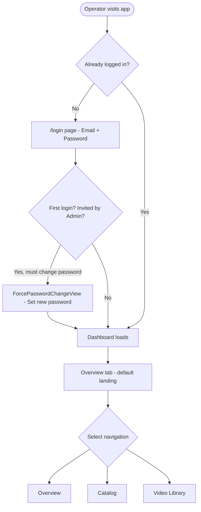

---

### Overview Tab (Read-Only)


> [!NOTE]
> Operator sees the same Overview as Lead and Admin — it's entirely read-only. Operators cannot access `Analytics`, `Approvals`, or `Planning`.

---

### Catalog Tab (View Only)

```mermaid
flowchart TD
    A([Operator on Catalog]) --> B["Browses BuckedUp product catalog - All supplements, drinks, apparel and gear"]
    B --> C{Apply filters}
    C --> D[Search by name / variant]
    C --> E[Filter by Category / Subcategory]
    C --> F["Filter by AIGC Status - none / in-progress / published"]
    C --> G["Filter by Flag - Bestseller / New / Clearance"]
    C --> H["Filter by Availability - active / inactive / all"]
    D & E & F & G & H --> I[Views filtered product grid or list]
    I --> J{Open product detail?}
    J -- Yes --> K["Detail panel: name, category, variants, price, AIGC badge"]
    K --> L{Linked video production item?}
    L -- Yes --> M[Sees link to Video Library item]
    L -- No --> N["Sees 'No Video' badge"]
    J -- No --> O([Continue browsing])

    style B fill:#1a2744,stroke:#4a6fa5,color:#e0e8ff

    subgraph BLOCKED_OP_CAT ["Actions blocked for Operator in Catalog"]
        BL1["Cannot: Add catalog item"]
        BL2["Cannot: Edit catalog item"]
        BL3["Cannot: Delete catalog item"]
        BL4["Cannot: Request video from catalog"]
    end

    style BLOCKED_OP_CAT fill:#3d1a1a,stroke:#dc3545
    style BL1 fill:#3d1a1a,stroke:#dc3545,color:#ff8888
    style BL2 fill:#3d1a1a,stroke:#dc3545,color:#ff8888
    style BL3 fill:#3d1a1a,stroke:#dc3545,color:#ff8888
    style BL4 fill:#3d1a1a,stroke:#dc3545,color:#ff8888
```

---

### Video Library Tab — Core Operator Flow

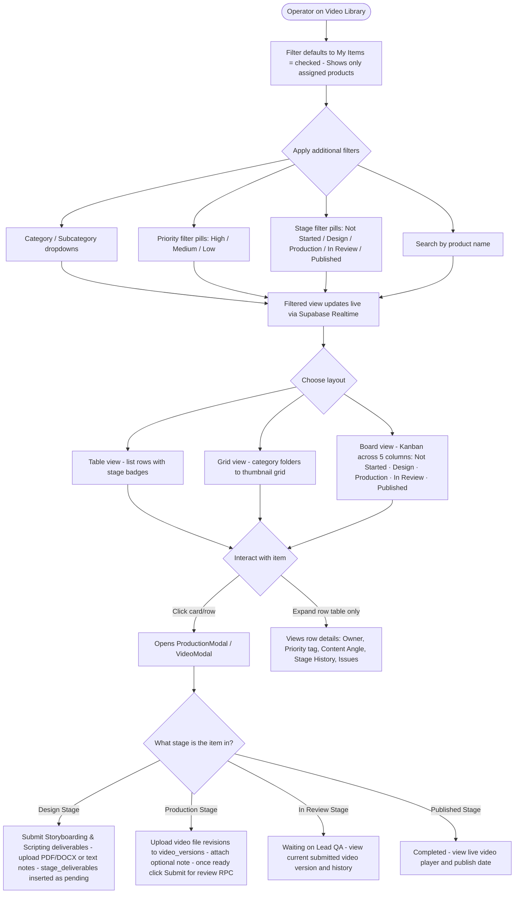

---

### Operator: Issue Tracking


---

### Operator: What They CANNOT Do

```mermaid
flowchart LR
    subgraph BLOCKED_OP ["Actions Blocked for Operator - DB Enforced"]
        B1["Move product stage directly - DB trigger rejects status changes unless via submit_video_for_review RPC"]
        B2["Create new products or add product to pipeline"]
        B3["Edit catalog fields - name, category, owner, content angle"]
        B4["Delete products"]
        B5["Access Approvals tab - not rendered in TabBar for operator role"]
        B6["Access Analytics tab - route guard redirects to Overview"]
        B7["Submit deliverables for non-owned products - RLS blocks insert where owner_id does not match auth.uid"]
        B8["Change user roles"]
        B9["Create or edit production plan"]
        B10["Approve or reject deliverables - no Review buttons shown"]
        B11["Request videos from Catalog - Request from Catalog button hidden"]
    end
    style BLOCKED_OP fill:#3d1a1a,stroke:#dc3545
    style B1 fill:#3d1a1a,stroke:#dc3545,color:#ff8888
    style B2 fill:#3d1a1a,stroke:#dc3545,color:#ff8888
    style B3 fill:#3d1a1a,stroke:#dc3545,color:#ff8888
    style B4 fill:#3d1a1a,stroke:#dc3545,color:#ff8888
    style B5 fill:#3d1a1a,stroke:#dc3545,color:#ff8888
    style B6 fill:#3d1a1a,stroke:#dc3545,color:#ff8888
    style B7 fill:#3d1a1a,stroke:#dc3545,color:#ff8888
    style B8 fill:#3d1a1a,stroke:#dc3545,color:#ff8888
    style B9 fill:#3d1a1a,stroke:#dc3545,color:#ff8888
    style B10 fill:#3d1a1a,stroke:#dc3545,color:#ff8888
    style B11 fill:#3d1a1a,stroke:#dc3545,color:#ff8888
```

---

### Notifications — Operator

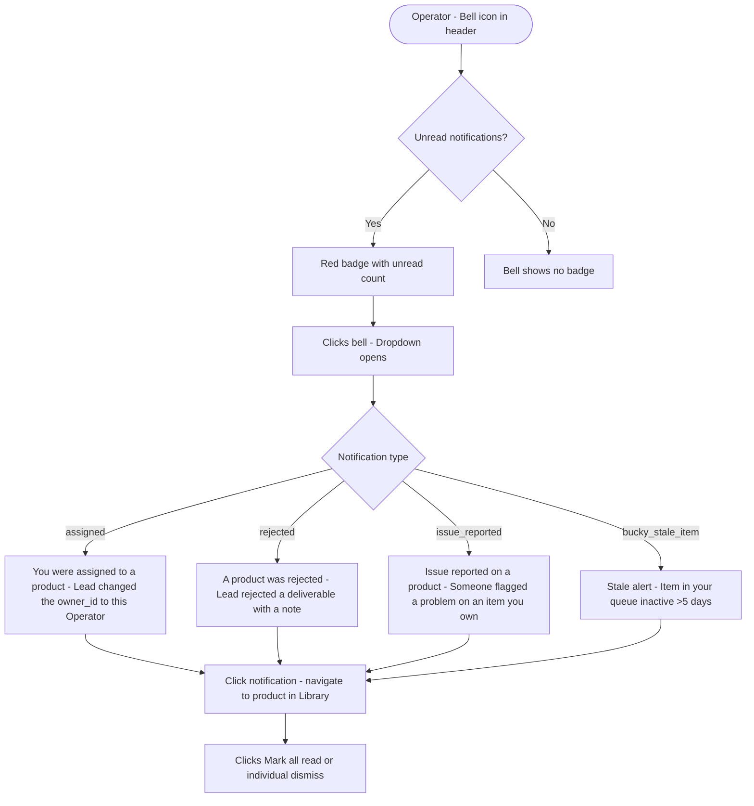

---

## 🟨 LEAD WORKFLOW

> **Lead = The operational owner of the entire pipeline.**  
> Leads create video requests, assign priority (`High/Medium/Low`), configure targets, review all deliverables inside the **Approvals Inbox** (`ReviewsView`), and are the only ones who can advance a product past QA gates or drag items across stages.

### Access & Entry

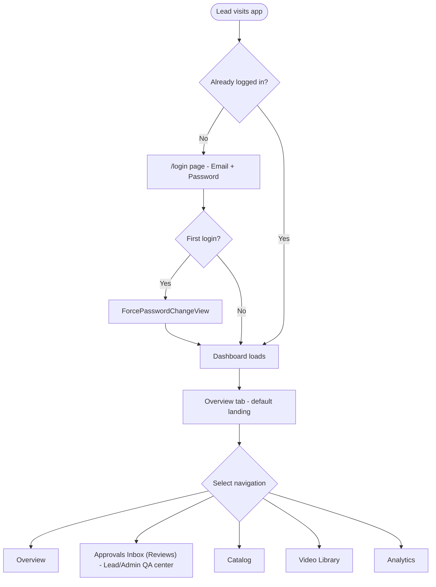

---

### Approvals Inbox Tab (`ReviewsView.tsx` — Core QA Center)

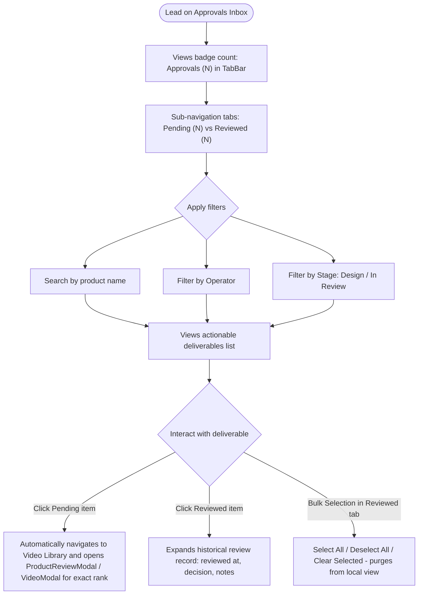

---

### Catalog Tab — Lead (Full Management)

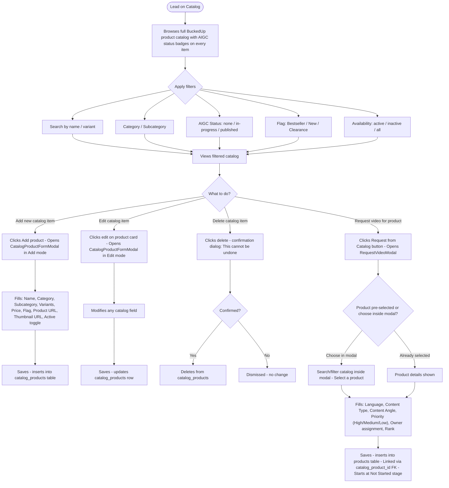

---

### Video Library Tab — Lead: Full Pipeline Control

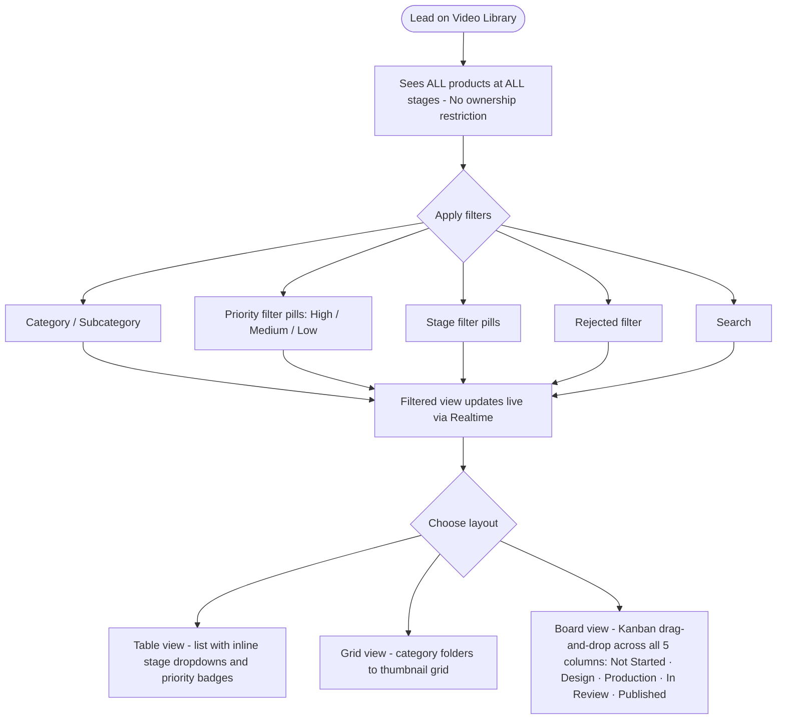

---

### Video Library — Lead: Reviewing Deliverables (`ProductReviewModal`)

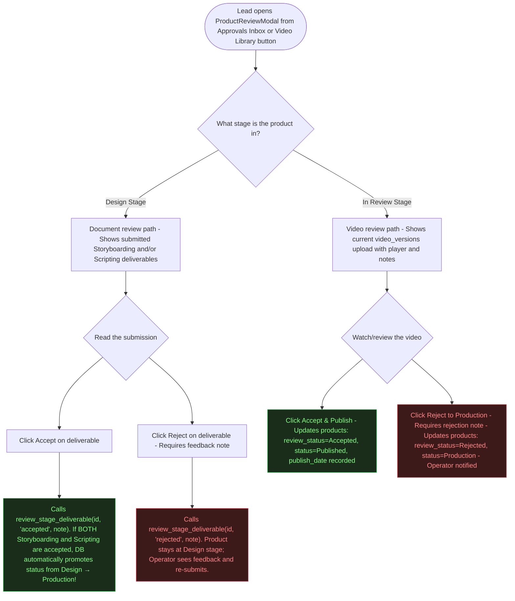

---

### Lead: What They CANNOT Do

```mermaid
flowchart LR
    subgraph BLOCKED_LEAD ["Actions Blocked for Lead - DB and UI Enforced"]
        B1["Access Planning tab - Admin-only corporate Excel target import"]
        B2["Access Admin tab - User governance tab is Admin-only"]
        B3["Create/invite/delete user accounts - Admin-only API route /api/admin/create-user"]
        B4["Change user roles - profiles_enforce_role_change trigger blocks non-admin writes"]
        B5["View Bucky AI Audit Logs tab - Admin-only"]
    end
    style BLOCKED_LEAD fill:#3d1a1a,stroke:#dc3545
    style B1 fill:#3d1a1a,stroke:#dc3545,color:#ff8888
    style B2 fill:#3d1a1a,stroke:#dc3545,color:#ff8888
    style B3 fill:#3d1a1a,stroke:#dc3545,color:#ff8888
    style B4 fill:#3d1a1a,stroke:#dc3545,color:#ff8888
    style B5 fill:#3d1a1a,stroke:#dc3545,color:#ff8888
```

---

## 🟥 ADMIN WORKFLOW

> **Admin = Governance & Corporate Planning.**  
> Admins manage user accounts (`profiles`), import corporate Excel spreadsheets (`PlanningView`), and audit AI execution logs (`Bucky`). They have **no write access to the day-to-day video production pipeline**. In the Video Library, they only see Published items.

### Access & Entry

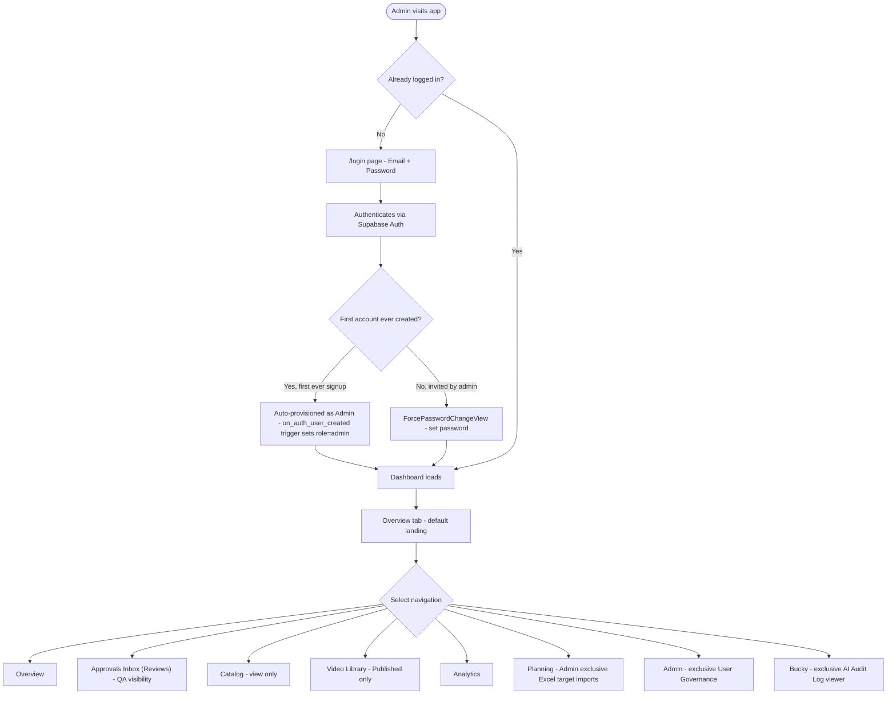

---

### Planning Tab — Admin Exclusive (`PlanningView.tsx`)

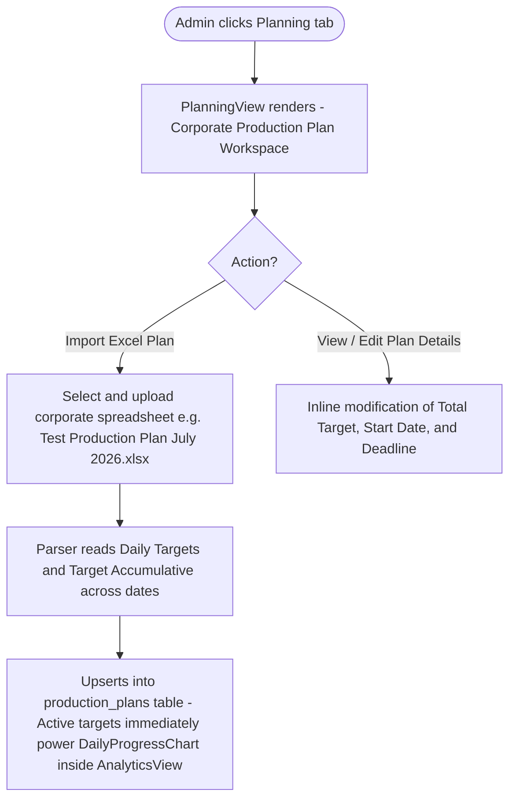

---

### Admin Tab — User Governance (Admin Exclusive)

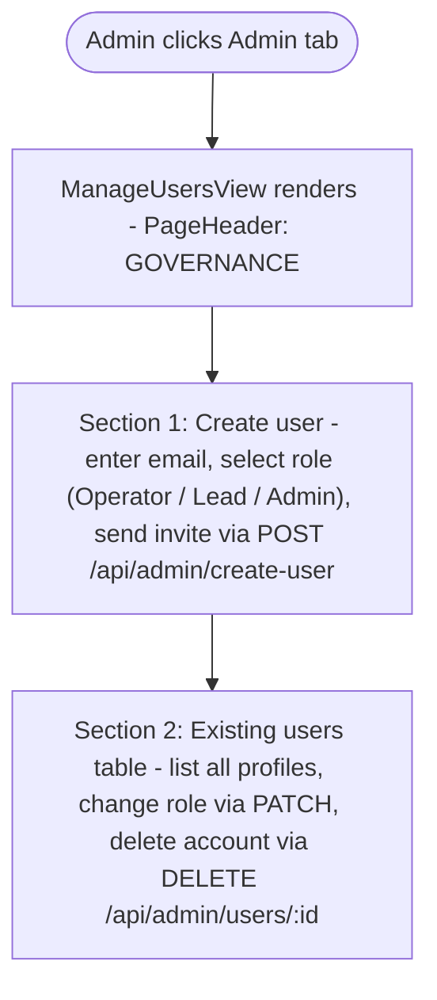

---

### Bucky Tab — AI Audit Logs (Admin Exclusive)

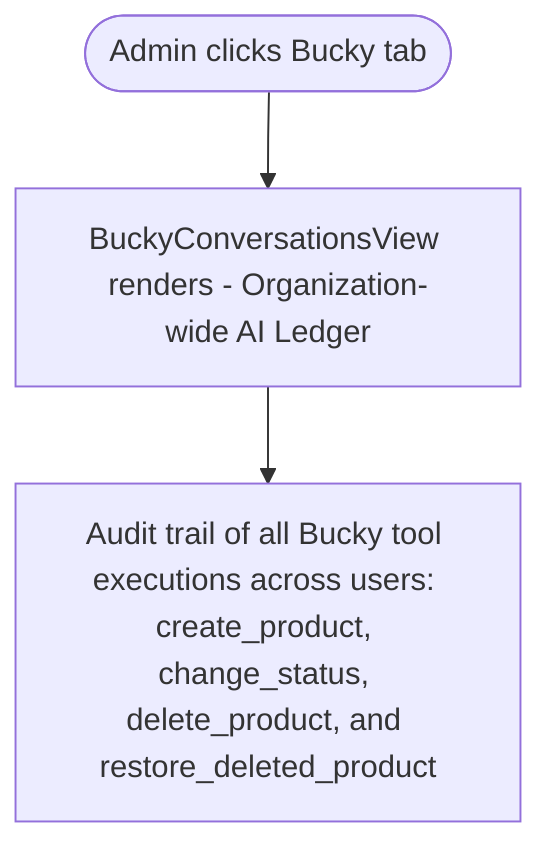

---

## Complete Pipeline Lifecycle — All Roles Together

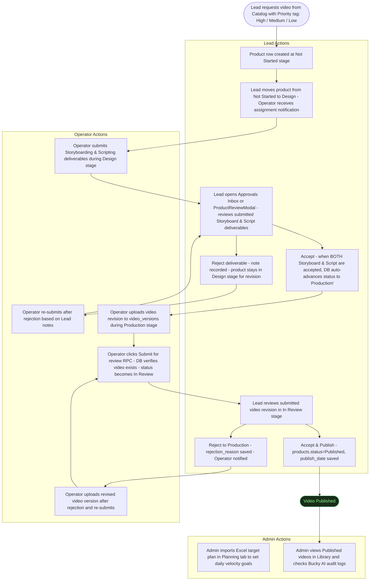

---

## Role Permission Matrix (Complete Reference)

| Action | Operator | Lead | Admin | DB / UI Enforcement |
|--------|----------|------|-------|---------------------|
| **Login / sign out** | ✅ | ✅ | ✅ | Supabase Auth |
| **View Overview** | ✅ | ✅ | ✅ | — |
| **View Approvals Inbox (`reviews`)** | ❌ | ✅ | ✅ | TabBar role check (`role === 'lead' || role === 'admin'`) |
| **Browse Catalog** | ✅ | ✅ | ✅ | — |
| **Add/edit/delete catalog items** | ❌ | ✅ | ❌ | `catalog_products` RLS & UI check |
| **Request video from catalog** | ❌ | ✅ | ❌ | `products` insert RLS |
| **View Library — all stages** | ✅ | ✅ | ❌ (Published only) | UI filter (`isAdmin && status !== 'Published'`) |
| **Board (Kanban) layout** | ✅ (view only) | ✅ + drag | ❌ | UI (`canMoveStage = isLead`) |
| **Submit document deliverables** | ✅ | ❌ | ❌ | `stage_deliverables` RLS |
| **Upload video version (`video_versions`)** | ✅ (own items) | ✅ | ❌ | `video_versions` RLS |
| **Submit for review (`RPC`)** | ✅ (own items) | ❌ | ❌ | `submit_video_for_review()` SQL validation |
| **Review stage deliverables (`RPC`)** | ❌ | ✅ | ❌ | `review_stage_deliverable()` SQL check |
| **Accept both docs → auto-advance to Production** | ❌ | ✅ | ❌ | Automated SQL trigger / function |
| **Accept video → publish** | ❌ | ✅ | ❌ | `products` update RLS |
| **Reject video → back to Production** | ❌ | ✅ | ❌ | `products` update RLS (`rejection_reason`) |
| **Add / edit / delete product** | ❌ | ✅ | ❌ | `enforce_product_update_permissions` trigger |
| **Set priority (`High/Medium/Low`)** | ❌ | ✅ | ❌ | `products` update RLS |
| **Report / resolve issues** | ✅ | ✅ | ✅ (Published only) | `issues` RLS |
| **View Analytics charts** | ❌ (redirects) | ✅ | ✅ | Route guard + UI check |
| **View Planning tab (Excel imports)** | ❌ | ❌ | ✅ | TabBar role check (`role === 'admin'`) |
| **View Admin tab (User governance)** | ❌ | ❌ | ✅ | TabBar role check (`role === 'admin'`) |
| **View Bucky AI Audit Logs tab** | ❌ | ❌ | ✅ | TabBar role check (`role === 'admin'`) |
| **Bucky AI Assistant (`BuckyWidget`)** | ✅ | ✅ | ✅ | Contextual streaming chat |
